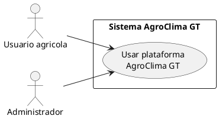
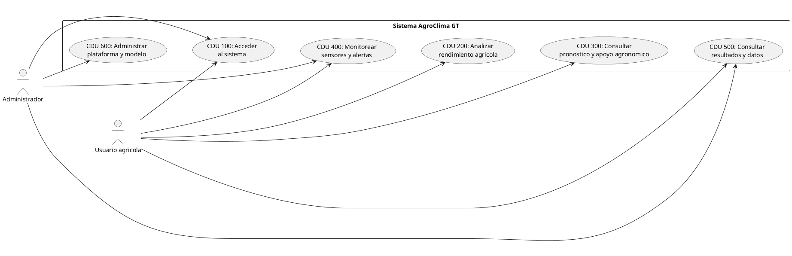
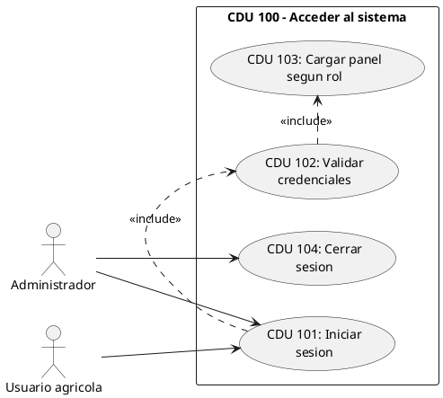
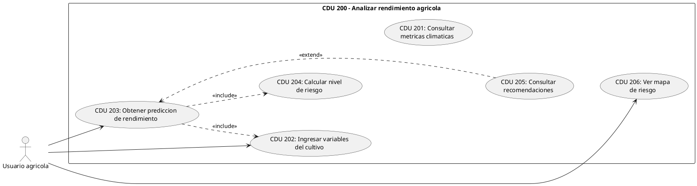
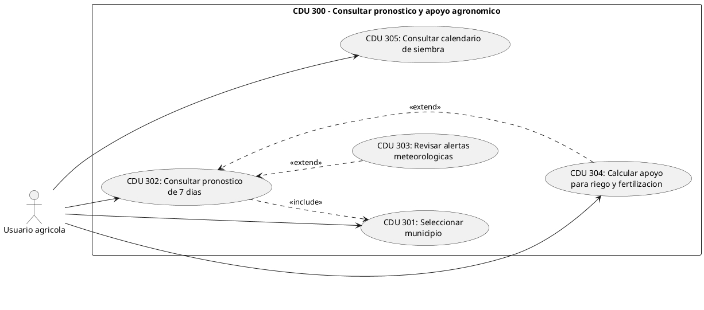
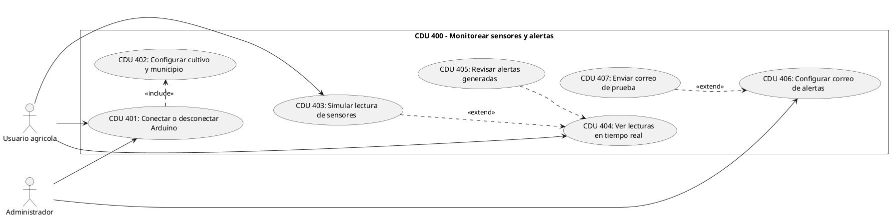
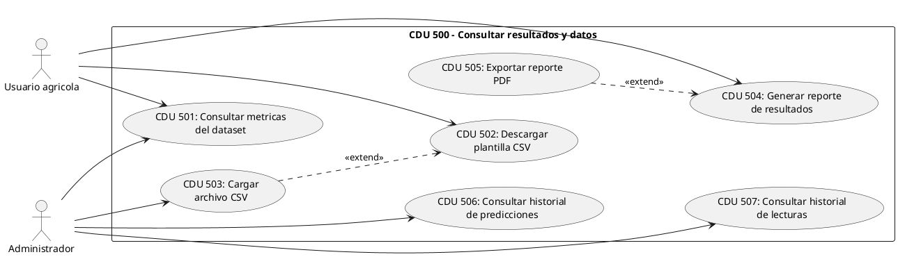
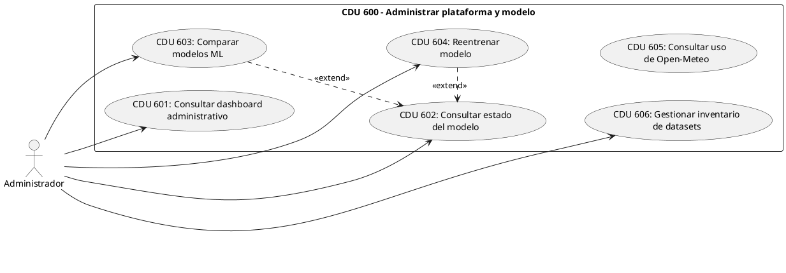

# 4.1. Arquitectura general del sistema predictivo

El prototipo AgroClima GT se diseñó como una aplicación web local para apoyar el análisis agroclimático y la predicción de rendimiento agrícola. La arquitectura no se plantea como un sistema de microservicios completo desplegado en producción, sino como un prototipo integrado que separa sus funciones principales en frontend, backend, capa de datos, modelo de aprendizaje automático y módulo de sensores.

La parte visual está desarrollada en React y Vite. Desde esta interfaz el usuario puede ingresar datos del cultivo, consultar métricas, ver alertas, revisar pronósticos, usar el módulo de Arduino y generar reportes. La interfaz se comunica con el backend por medio de peticiones HTTP y también por WebSocket cuando se trabaja con lecturas en tiempo real.

El backend está hecho con FastAPI y concentra la lógica principal del sistema. En esta capa se validan los datos de entrada, se consulta el modelo XGBoost, se ejecuta la detección de anomalías con Isolation Forest, se generan alertas por reglas agronómicas y se consultan fuentes como Open-Meteo. FastAPI se eligió porque permite construir APIs en Python con validación de datos y documentación automática basada en estándares como OpenAPI (FastAPI, s.f.).

La capa de datos está formada por archivos locales y por PostgreSQL. Los archivos locales guardan datasets, modelos entrenados, métricas, codificadores y fuentes climáticas procesadas. PostgreSQL se usa cuando está activo para guardar usuarios, predicciones, lecturas, alertas, datasets y datos administrativos. La base de datos se levanta con Docker Compose, que permite definir servicios, volúmenes y configuración de la aplicación desde un archivo YAML (Docker, s.f.).

El sistema también contempla un módulo de sensores con Arduino. En esta fase, la parte física todavía queda como propuesta pendiente de validación en campo. Lo que sí existe en el software es la capacidad de conectarse por puerto serial, simular lecturas, procesarlas en el backend y enviarlas al frontend por WebSocket. Por eso, en esta tesis se describe el módulo de sensores como parte planificada del prototipo, no como una red ya instalada en parcelas.

El flujo general del sistema inicia cuando el usuario ingresa variables del cultivo o cuando se recibe una lectura desde Arduino. Luego el backend prepara los datos, ejecuta la predicción con XGBoost, revisa posibles anomalías con Isolation Forest y compara las variables contra rangos agronómicos. Finalmente, el frontend muestra el resultado en forma de rendimiento estimado, nivel de riesgo, alerta o recomendación.

No se debe describir esta versión como una red LoRaWAN, MQTT, InfluxDB, Celery o Telegram, porque esos componentes no están implementados en el proyecto actual. Esos elementos podrían quedar como una posible ampliación futura si después se decide llevar el sistema a campo con comunicación inalámbrica.

## Diagrama 1. Casos de uso de alto nivel

Aquí va la imagen exportada del diagrama `AgroClimaGT_CDU_AltoNivel_Corregido`.

**Figura 1**  
Casos de uso de alto nivel del prototipo AgroClima GT.

**Nota.** Elaboración propia a partir del archivo `agroclima_gt_cdu_corregidos.puml`, usando PlantUML. En este diagrama solo se muestran stakeholders humanos, porque los casos de uso representan objetivos de usuarios externos al sistema.

Referencia APA sugerida para la figura:  
Elaboración propia. (2026). *Casos de uso de alto nivel del prototipo AgroClima GT* [Diagrama PlantUML].

### Código PlantUML



## Diagrama 2. Primera descomposición de casos de uso

Aquí va la imagen exportada del diagrama `AgroClimaGT_CDU_PrimeraDescomposicion_Corregido`.

**Figura 2**  
Primera descomposición de casos de uso del sistema AgroClima GT.

**Nota.** Elaboración propia a partir del archivo `agroclima_gt_cdu_corregidos.puml`, usando PlantUML. El diagrama separa el sistema en seis grupos de funciones visibles para el usuario agrícola y el administrador. Los servicios técnicos como PostgreSQL, Open-Meteo, SMTP, Arduino y el modelo ML no se usan como actores en este diagrama porque no son stakeholders.

Referencia APA sugerida para la figura:  
Elaboración propia. (2026). *Primera descomposición de casos de uso del sistema AgroClima GT* [Diagrama PlantUML].

### Código PlantUML



## Diagramas expandidos por CDU

En la primera descomposición aparecen seis casos principales. Por eso se agregan seis diagramas expandidos: CDU 100, CDU 200, CDU 300, CDU 400, CDU 500 y CDU 600. En cada uno se mantiene la numeración interna según el caso padre. Por ejemplo, si el caso principal es CDU 100, sus casos internos son CDU 101, CDU 102, CDU 103 y así.

### CDU 100 - Acceder al sistema

Aquí va la imagen exportada del diagrama `AgroClimaGT_CDU_100_Corregido`.

**Figura 3**  
Diagrama expandido del CDU 100: Acceder al sistema.

**Nota.** Elaboración propia a partir del archivo `agroclima_gt_cdu_corregidos.puml`, usando PlantUML. El diagrama muestra el inicio de sesión, validación de credenciales, carga de panel según rol y cierre de sesión.

Referencia APA sugerida para la figura:  
Elaboración propia. (2026). *Diagrama expandido del CDU 100: Acceder al sistema* [Diagrama PlantUML].



### CDU 200 - Analizar rendimiento agricola

Aquí va la imagen exportada del diagrama `AgroClimaGT_CDU_200_Corregido`.

**Figura 4**  
Diagrama expandido del CDU 200: Analizar rendimiento agricola.

**Nota.** Elaboración propia a partir del archivo `agroclima_gt_cdu_corregidos.puml`, usando PlantUML. El diagrama muestra la consulta de métricas, ingreso de variables, predicción, cálculo de riesgo, recomendaciones y mapa de riesgo.

Referencia APA sugerida para la figura:  
Elaboración propia. (2026). *Diagrama expandido del CDU 200: Analizar rendimiento agricola* [Diagrama PlantUML].



### CDU 300 - Consultar pronostico y apoyo agronomico

Aquí va la imagen exportada del diagrama `AgroClimaGT_CDU_300_Corregido`.

**Figura 5**  
Diagrama expandido del CDU 300: Consultar pronostico y apoyo agronomico.

**Nota.** Elaboración propia a partir del archivo `agroclima_gt_cdu_corregidos.puml`, usando PlantUML. El diagrama muestra la consulta de pronóstico, alertas meteorológicas, apoyo para riego/fertilización y calendario de siembra.

Referencia APA sugerida para la figura:  
Elaboración propia. (2026). *Diagrama expandido del CDU 300: Consultar pronostico y apoyo agronomico* [Diagrama PlantUML].



### CDU 400 - Monitorear sensores y alertas

Aquí va la imagen exportada del diagrama `AgroClimaGT_CDU_400_Corregido`.

**Figura 6**  
Diagrama expandido del CDU 400: Monitorear sensores y alertas.

**Nota.** Elaboración propia a partir del archivo `agroclima_gt_cdu_corregidos.puml`, usando PlantUML. El diagrama muestra conexión o simulación de Arduino, visualización de lecturas, alertas y configuración de correo.

Referencia APA sugerida para la figura:  
Elaboración propia. (2026). *Diagrama expandido del CDU 400: Monitorear sensores y alertas* [Diagrama PlantUML].



### CDU 500 - Consultar resultados y datos

Aquí va la imagen exportada del diagrama `AgroClimaGT_CDU_500_Corregido`.

**Figura 7**  
Diagrama expandido del CDU 500: Consultar resultados y datos.

**Nota.** Elaboración propia a partir del archivo `agroclima_gt_cdu_corregidos.puml`, usando PlantUML. El diagrama muestra consulta de métricas, plantilla CSV, carga de archivo, reportes e historiales.

Referencia APA sugerida para la figura:  
Elaboración propia. (2026). *Diagrama expandido del CDU 500: Consultar resultados y datos* [Diagrama PlantUML].



### CDU 600 - Administrar plataforma y modelo

Aquí va la imagen exportada del diagrama `AgroClimaGT_CDU_600_Corregido`.

**Figura 8**  
Diagrama expandido del CDU 600: Administrar plataforma y modelo.

**Nota.** Elaboración propia a partir del archivo `agroclima_gt_cdu_corregidos.puml`, usando PlantUML. El diagrama muestra funciones administrativas sobre estado del sistema, modelo, comparación, reentrenamiento, uso de Open-Meteo e inventario de datasets.

Referencia APA sugerida para la figura:  
Elaboración propia. (2026). *Diagrama expandido del CDU 600: Administrar plataforma y modelo* [Diagrama PlantUML].



## Diagrama de despliegue local del prototipo

Aquí va la imagen exportada del diagrama `AgroClimaGT_Despliegue`.

**Figura 9**  
Diagrama de despliegue local del prototipo AgroClima GT.

**Nota.** Elaboración propia a partir del archivo `agroclima_gt_diagramas.puml`, usando PlantUML. El diagrama muestra cómo se relacionan el navegador, el frontend publicado en GitHub Pages, el backend FastAPI, los archivos locales, PostgreSQL, Arduino, Open-Meteo y el servidor SMTP.

Referencia APA sugerida para la figura:  
Elaboración propia. (2026). *Diagrama de despliegue local del prototipo AgroClima GT* [Diagrama PlantUML].

### Código PlantUML

```plantuml
@startuml AgroClimaGT_Despliegue
title AgroClima GT - Diagrama de Despliegue
left to right direction
skinparam componentStyle rectangle

cloud "GitHub Pages" as GitHubPages {
  artifact "Frontend publicado\nbuild / dist" as FrontendDeploy
}

node "PC / Laptop del usuario" as ClientNode {
  artifact "Navegador Web" as Browser
}

node "Host local Windows\nC:\\Users\\edgar\\Downloads\\TESISXD\\conferencia" as Host {
  node "Proceso Uvicorn" as Uvicorn {
    artifact "FastAPI API\nbackend/api.py\n:8000" as API
    artifact "Modulo ML\nbackend/ml_insights.py" as ML
    artifact "Lector Arduino\nbackend/arduino_reader.py" as Reader
    artifact "Motor de alertas\nbackend/alert_engine.py" as AlertEngine
    artifact "Notificador\nbackend/email_notifier.py" as Mailer
  }

  folder "Archivos locales" as Storage {
    artifact "Modelo joblib\nxgboost_yield.joblib" as ModelFile
    artifact "Encoders / metricas /\nCSV / logs JSON" as DataFiles
  }

  node "Docker Engine" as Docker {
    node "Contenedor PostgreSQL 16" as PgContainer {
      database "agroclima_db\n:5435" as PostgreSQL
    }
  }
}

node "Dispositivo fisico" as Edge {
  device "Arduino + sensores\n(temperatura, luz,\nhumedad suelo, color/pH)" as Arduino
}

cloud "API Open-Meteo" as OpenMeteo
cloud "Servidor SMTP" as SMTP

Browser --> GitHubPages : abre pagina web
GitHubPages --> Browser : entrega interfaz React
Browser --> API : envia datos / consulta resultados
Browser --> API : recibe lecturas en tiempo real
API --> PostgreSQL : guarda predicciones y lecturas
API --> ModelFile : carga modelo XGBoost
API --> DataFiles : lee datasets y metricas
Reader --> Arduino : recibe lecturas por USB
API --> OpenMeteo : consulta pronostico
Mailer --> SMTP : envia alertas por correo
@enduml
```

## Capturas sugeridas para acompañar la arquitectura

Estas capturas se pueden colocar después de los diagramas, para mostrar cómo se ve el prototipo funcionando.

### Captura 1. Pantalla de inicio de sesión

Aquí va captura de la pantalla de login.

**Figura 10**  
Pantalla de inicio de sesión de AgroClima GT.

**Nota.** Elaboración propia a partir del prototipo web AgroClima GT ejecutado en ambiente local.

Referencia APA sugerida para la imagen:  
Elaboración propia. (2026). *Pantalla de inicio de sesión de AgroClima GT* [Captura de pantalla].

### Captura 2. Dashboard principal

Aquí va captura del dashboard donde se ingresan municipio, cultivo y variables climáticas.

**Figura 11**  
Panel principal para análisis agroclimático.

**Nota.** Elaboración propia a partir del prototipo web AgroClima GT ejecutado en ambiente local. La pantalla muestra el formulario de análisis y los indicadores principales del sistema.

Referencia APA sugerida para la imagen:  
Elaboración propia. (2026). *Panel principal para análisis agroclimático en AgroClima GT* [Captura de pantalla].

### Captura 3. Resultado de predicción

Aquí va captura después de ejecutar una predicción.

**Figura 12**  
Resultado de predicción de rendimiento agrícola.

**Nota.** Elaboración propia a partir del prototipo web AgroClima GT ejecutado en ambiente local. La pantalla muestra el rendimiento estimado, el nivel de riesgo y la recomendación generada.

Referencia APA sugerida para la imagen:  
Elaboración propia. (2026). *Resultado de predicción de rendimiento agrícola en AgroClima GT* [Captura de pantalla].

### Captura 4. Módulo de Arduino

Aquí va captura del módulo Arduino. Si todavía no están conectados los sensores físicos, se puede usar una lectura simulada.

**Figura 13**  
Panel de monitoreo Arduino con lectura simulada.

**Nota.** Elaboración propia a partir del prototipo web AgroClima GT ejecutado en ambiente local. La pantalla muestra el flujo preparado para recibir lecturas de sensores, aunque la prueba física en campo queda pendiente.

Referencia APA sugerida para la imagen:  
Elaboración propia. (2026). *Panel de monitoreo Arduino con lectura simulada en AgroClima GT* [Captura de pantalla].

### Captura 5. Panel administrativo

Aquí va captura del panel administrativo o del inventario de datasets.

**Figura 14**  
Panel administrativo del prototipo AgroClima GT.

**Nota.** Elaboración propia a partir del prototipo web AgroClima GT ejecutado en ambiente local. La pantalla muestra funciones de administración como estadísticas, datasets, predicciones, lecturas o estado del modelo.

Referencia APA sugerida para la imagen:  
Elaboración propia. (2026). *Panel administrativo del prototipo AgroClima GT* [Captura de pantalla].

## Referencias

Docker. (s.f.). *How Compose works*. Docker Docs. Recuperado el 27 de abril de 2026, de https://docs.docker.com/compose/intro/compose-application-model/

FastAPI. (s.f.). *Features*. FastAPI documentation. Recuperado el 27 de abril de 2026, de https://fastapi.tiangolo.com/features/

PlantUML. (s.f.). *PlantUML at a glance*. Recuperado el 27 de abril de 2026, de https://plantuml.com/
