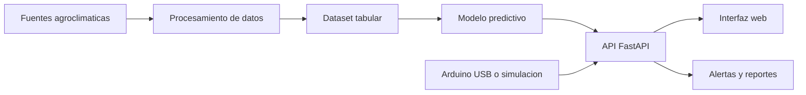
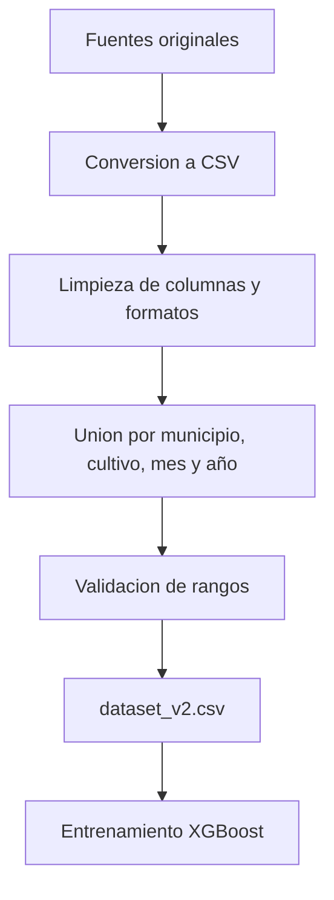
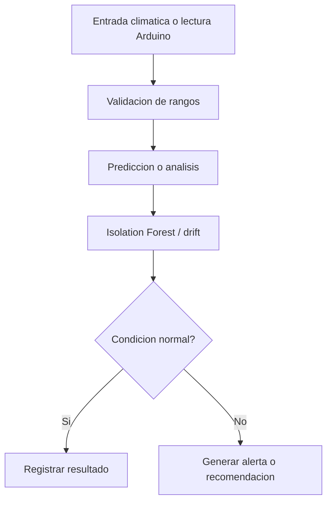
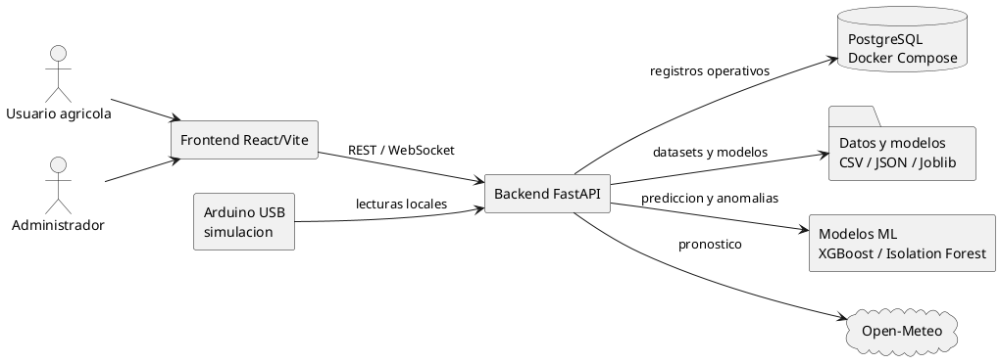
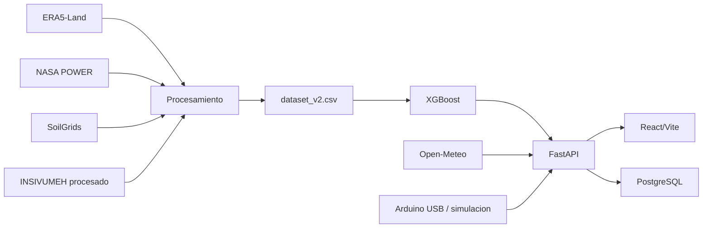

# Sección corregida para tesis: descripción del prototipo AgroClima GT

Este documento es una versión nueva y corregida para incorporar la parte del prototipo en la tesis sin reemplazar `tesis.md` ni `referencias.md`. La redacción diferencia entre lo que ya está implementado en `C:\Users\edgar\Downloads\TESISXD\conferencia` y lo que corresponde a la descripción planificada del componente físico con sensores.

No se incluyen citas textuales extensas. Las citas integradas son paráfrasis con formato autor-fecha según APA 7. Si posteriormente se agregan citas textuales, debe incluirse número de página cuando exista, o número de párrafo/sección cuando sea una página web sin paginación.

## 1. Delimitación del prototipo implementado

El prototipo AgroClima GT es una plataforma web de apoyo a la decisión agroclimática orientada al análisis de variables climáticas, edáficas y agrícolas para estimar rendimiento, generar alertas y presentar recomendaciones por cultivo y municipio. La implementación revisada se compone de un backend desarrollado en FastAPI, un frontend construido con React y Vite, una base de datos PostgreSQL ejecutable mediante Docker Compose, modelos de aprendizaje automático persistidos localmente y archivos de datos climáticos y agronómicos en formatos CSV, JSON, NetCDF y Joblib.

El alcance del prototipo es académico y demostrativo. Su propósito no es sustituir la validación agronómica en campo ni emitir alertas oficiales, sino demostrar la viabilidad técnica de integrar datos agroclimáticos, fuentes meteorológicas, sensores simulados o conectados localmente, aprendizaje automático y visualización web. Por ello, los resultados generados por el sistema deben interpretarse como apoyo preliminar para la toma de decisiones.

En la versión revisada del proyecto, el componente de sensores físicos todavía no se ha validado en campo. El software sí contiene módulos para conectarse a Arduino por puerto serial, recibir lecturas, simular datos, transmitirlos por WebSocket y analizarlos con el modelo predictivo. Sin embargo, la instalación física de sensores, la calibración del hardware y las pruebas de campo deben presentarse como trabajo pendiente o como diseño propuesto, no como resultados ya ejecutados.

## 2. Fuentes de datos utilizadas por el prototipo

El sistema utiliza una combinación de fuentes climáticas y agronómicas procesadas localmente. La base histórica principal proviene de datos ERA5-Land, los cuales permiten representar variables terrestres y climáticas de forma consistente para aplicaciones de monitoreo y análisis de tendencias (Muñoz-Sabater et al., 2021). En el proyecto existen archivos NetCDF anuales y CSV procesados, entre ellos `era5_mensual.csv`, `dataset_v2.csv`, `water_stress_index.csv` y `sowing_calendar.csv`.

Además de ERA5-Land, el prototipo integra datos derivados de NASA POWER para variables como radiación solar, temperatura máxima, temperatura mínima y viento. NASA POWER ofrece servicios de datos mediante API REST para distribuir información en formatos listos para análisis, lo cual justifica su uso como fuente complementaria en sistemas de soporte técnico y modelado climático (NASA POWER, s.f.).

Para características de suelo se utiliza SoilGrids, una fuente global de información edáfica que estima propiedades como pH, carbono orgánico, textura, densidad aparente y otros atributos a partir de perfiles de suelo y covariables ambientales (ISRIC, 2025). En el prototipo, esta fuente aparece procesada como `soilgrids_suelo.csv`, especialmente para incorporar el pH del suelo por municipio.

El prototipo también utiliza Open-Meteo para consultar pronóstico meteorológico. La documentación de Open-Meteo describe una API de pronóstico que acepta coordenadas geográficas y devuelve datos horarios o diarios en formato JSON, lo cual permite integrarla directamente en aplicaciones web (Open-Meteo, s.f.). En AgroClima GT, esta integración alimenta la vista de pronóstico y puede completar variables del formulario principal.

Finalmente, el proyecto incluye datos recientes de INSIVUMEH procesados localmente en archivos diarios y mensuales. Estos datos se consultan mediante endpoints del backend y se usan como referencia nacional complementaria. Debe redactarse como integración de datos procesados, no como una conexión oficial en tiempo real con servicios institucionales.

## 3. Procesamiento de datos y construcción del dataset

El procesamiento de datos del prototipo se orienta a construir un dataset tabular para aprendizaje automático. El archivo principal `dataset_v2.csv` contiene variables como municipio, cultivo, mes, año, temperatura, precipitación, humedad, humedad del suelo, temperatura del suelo, pH, luz estimada, índice de verdor, temperatura máxima, temperatura mínima, velocidad de viento y rendimiento estimado (`yield_pct`). Este dataset contiene 1,320,345 registros, 61 municipios y 37 cultivos, según la revisión local del proyecto.

La generación del dataset se apoya en scripts ubicados en `backend/scripts/datasets/` y `backend/scripts/processing/`. Estos scripts cargan fuentes climáticas y de suelo, calculan variables derivadas, construyen indicadores agronómicos y preparan datos para entrenamiento. La información de cultivos se complementa con `crop_optimal_conditions.csv`, que define rangos óptimos por cultivo, y `recommendations.csv`, que contiene recomendaciones agronómicas por variable, condición y severidad.

En esta versión corregida no debe afirmarse que el entrenamiento se basa exclusivamente en mediciones reales de campo. Lo correcto es indicar que se combinan fuentes climáticas históricas, datos de suelo, fuentes complementarias y reglas agronómicas para construir un dataset de entrenamiento y evaluación del prototipo.

## 4. Modelo predictivo de rendimiento agrícola

El modelo predictivo principal del prototipo utiliza XGBoost para estimar el porcentaje de rendimiento agrícola esperado (`yield_pct`). XGBoost es una biblioteca de gradient boosting optimizada para eficiencia, flexibilidad y portabilidad, y se aplica ampliamente a problemas tabulares de predicción (XGBoost Developers, s.f.). Esta elección es coherente con la estructura del dataset, ya que las variables de entrada son principalmente numéricas y categóricas codificadas.

En el backend, el modelo se carga desde `xgboost_yield.joblib` y los codificadores desde `label_encoders.joblib`. Antes de ejecutar la predicción, el sistema valida rangos fisiológicamente plausibles de temperatura, lluvia, humedad, pH, humedad del suelo y luz. Después de predecir, clasifica el rendimiento en niveles operativos y puede generar explicación de variables mediante SHAP cuando la dependencia está disponible.

El archivo `model_comparison.json` muestra una comparación interna del prototipo. En esa comparación, XGBoost obtuvo R2 de 0.7157, MAE de 4.86 y RMSE de 6.04, mientras Random Forest obtuvo R2 de 0.4485, MAE de 6.84 y RMSE de 8.42. Estos resultados deben reportarse como resultados internos del prototipo local, no como validación definitiva en campo.

## 5. Detección de anomalías y monitoreo de datos

El prototipo implementa detección de anomalías mediante Isolation Forest. Este algoritmo identifica observaciones atípicas a partir de particiones aleatorias; las observaciones anómalas tienden a requerir rutas más cortas para ser aisladas dentro del conjunto de árboles (Liu et al., 2008; scikit-learn Developers, s.f.). En AgroClima GT, este enfoque se usa para detectar entradas o lecturas de sensores que se alejan del comportamiento esperado.

La tesis debe evitar presentar como implementados modelos LSTM, transformers, autoencoders, Modified Z-Score como núcleo funcional o descomposición STL. Esos métodos pueden mencionarse únicamente como antecedentes o alternativas de la literatura, pero el prototipo revisado utiliza XGBoost para predicción e Isolation Forest para anomalías.

El backend también calcula indicadores de drift mediante un perfil de entrenamiento guardado en `drift_profile.json`. Esta función permite comparar entradas recientes contra la distribución esperada del dataset de entrenamiento, lo cual ayuda a identificar cuando los datos actuales se alejan de las condiciones con las que fue entrenado el modelo.

## 6. Motor de alertas y recomendaciones

El sistema de alertas se basa en reglas agronómicas. Cada lectura o entrada se compara contra rangos óptimos por cultivo. Si una variable se encuentra por debajo o por encima del rango recomendado, el sistema clasifica la severidad y genera una recomendación. Esta lógica opera como complemento del modelo predictivo, ya que traduce desviaciones climáticas o edáficas en mensajes accionables.

Las recomendaciones provienen de archivos locales y pueden consultarse desde el frontend. El sistema también incluye configuración de correo para alertas críticas, siempre que exista una configuración SMTP válida. Por tanto, debe describirse como un mecanismo de notificación configurable y no como una red institucional de alerta temprana en producción.

## 7. Backend, API y persistencia

El backend está desarrollado con FastAPI. Este framework se apoya en estándares como OpenAPI y JSON Schema, facilita la validación de datos y genera documentación interactiva de la API (FastAPI, s.f.). En el prototipo, FastAPI expone endpoints para autenticación, salud del sistema, métricas, predicción, pronóstico, recomendaciones, datasets, Arduino, alertas, administración, reentrenamiento y comparación de modelos.

La persistencia se realiza con PostgreSQL 16 cuando la base de datos está activa. PostgreSQL proporciona una base relacional adecuada para registrar usuarios, predicciones, lecturas de Arduino, alertas, modelos, datasets, fuentes de datos y configuraciones (The PostgreSQL Global Development Group, 2025). En el proyecto, Docker Compose define el servicio `postgres`, el puerto local `5435`, las credenciales de desarrollo y el volumen persistente de datos.

Docker Compose se utiliza para describir y ejecutar servicios mediante un archivo YAML; su modelo permite definir servicios, redes, volúmenes y configuraciones de una aplicación (Docker, s.f.). En este prototipo, Compose se usa principalmente para levantar PostgreSQL y cargar el esquema inicial desde `backend/database/init.sql`.

## 8. Frontend y visualización

El frontend está construido con React y Vite. React organiza la interfaz mediante componentes que encapsulan lógica y presentación, lo cual facilita construir vistas interactivas y reutilizables (React, s.f.). En AgroClima GT, el frontend contiene vistas para dashboard, métricas, alertas, resultados, pronóstico, Arduino, modelos, mapa de riesgo y panel administrativo.

La interfaz consume el backend mediante `fetch` desde `src/services/api.js`. También usa WebSocket para recibir lecturas de Arduino en tiempo real desde `/ws/arduino`. Las gráficas se generan con Chart.js, el mapa de riesgo con Leaflet y la exportación de reportes con html2canvas y jsPDF.

La tesis debe describir esta interfaz como una herramienta de apoyo a la interpretación, no solo como una pantalla de resultados. Su función es convertir datos técnicos en indicadores comprensibles: rendimiento estimado, nivel de riesgo, alertas, recomendaciones, calendario de siembra, estrés hídrico y reportes exportables.

## 9. Componente de sensores: descripción propuesta y estado pendiente

El componente físico con sensores debe presentarse como una etapa propuesta o pendiente de validación en campo. El software ya contempla integración con Arduino mediante puerto serial, pero no debe afirmarse que existe una red LoRaWAN, MQTT, InfluxDB, Telegram API o despliegue de nodos en parcelas si eso todavía no se ha construido y probado.

La descripción recomendada para la tesis es la siguiente:

El prototipo contempla una futura integración física de sensores agrícolas conectados a un microcontrolador Arduino. Esta etapa permitiría capturar variables ambientales y de suelo, como temperatura del aire, humedad relativa, humedad del suelo, luminosidad, pH del suelo y, según disponibilidad del hardware, precipitación o índice de verdor. Las lecturas serían enviadas al backend mediante conexión serial local, donde el sistema ya cuenta con funciones para recibir, validar, simular, almacenar y retransmitir datos al frontend mediante WebSocket.

En esta fase, el Arduino operaría como nodo de adquisición de datos. El backend actuaría como capa de procesamiento, ejecutando predicción de rendimiento, detección de anomalías y generación de alertas. El frontend mostraría las lecturas en tiempo real, el historial reciente y las recomendaciones asociadas. Esta arquitectura permite validar primero el flujo local de adquisición y análisis antes de ampliar el sistema hacia comunicación inalámbrica, despliegue en campo o redes de largo alcance.

Si en el futuro se incorpora LoRaWAN, MQTT u otra tecnología de comunicación, esa ampliación debe documentarse como evolución del prototipo, no como parte de la versión actual. Las referencias sobre IoT agrícola y redes de sensores pueden mantenerse como antecedentes, siempre que la tesis aclare que el prototipo actual usa Arduino serial y simulación local.

## 10. Elementos que deben corregirse en el texto actual de `tesis.md`

Los siguientes puntos del documento actual deben tratarse como correcciones sugeridas:

- Cambiar "series históricas de reanálisis climático del INSIVUMEH" por "datos climáticos procesados de ERA5-Land, datos recientes de INSIVUMEH y fuentes complementarias".
- Cambiar "datos experimentales recolectados mediante sensores IoT desplegados en campo" por "datos de sensores contemplados para validación futura; actualmente el software permite conexión Arduino serial y simulación".
- Retirar LSTM como modelo implementado.
- Retirar STL como procesamiento implementado.
- Retirar Modified Z-Score como componente central implementado.
- Retirar LoRaWAN, MQTT, InfluxDB, Celery y Telegram API como componentes implementados.
- Cambiar arquitectura de microservicios por arquitectura de prototipo local con frontend React, backend FastAPI, PostgreSQL en Docker y archivos locales de datos/modelos.
- Cambiar "alerta de heladas a 24 horas" por "estimación de rendimiento, riesgo agroclimático y alertas por variables fuera de rango".
- Mantener referencias de LoRaWAN solo si se presentan como antecedente o posible evolución.
- Mantener referencias de LSTM/STL solo si se presentan como alternativas metodológicas no implementadas.

## 11. Texto breve listo para insertar en la tesis

El prototipo AgroClima GT se desarrolló como una plataforma local de apoyo a la decisión agroclimática. Integra datos climáticos históricos y recientes, propiedades de suelo, reglas agronómicas y modelos de aprendizaje automático para estimar rendimiento agrícola, detectar valores anómalos y generar recomendaciones por cultivo y municipio. La arquitectura implementada está compuesta por un backend FastAPI, un frontend React/Vite, una base de datos PostgreSQL ejecutable mediante Docker Compose, modelos XGBoost e Isolation Forest y archivos locales de datos climáticos y agronómicos.

El componente físico de sensores se plantea como una etapa complementaria pendiente de validación en campo. El software ya incluye conexión con Arduino por puerto serial, simulación de lecturas y transmisión en tiempo real mediante WebSocket; sin embargo, la instalación de sensores, calibración, pruebas de campo y evaluación de confiabilidad del hardware deben documentarse como trabajo futuro. De esta forma, la tesis diferencia claramente entre el prototipo de software ya desarrollado y la integración física de sensores que será necesaria para validar el sistema en condiciones reales.

## 12. Arquitectura del prototipo

La arquitectura de AgroClima GT se puede explicar como una aplicación web local dividida en cuatro partes principales: interfaz web, API backend, capa de datos y módulo de sensores. Esta división ayuda a entender cómo se mueve la información desde que el usuario ingresa datos o se recibe una lectura de Arduino, hasta que el sistema muestra una predicción, una alerta o una recomendación.

La primera parte es el frontend, construido con React y Vite. Esta capa es la que usa el usuario desde el navegador. Desde ahí se consultan métricas, se ingresan variables del cultivo, se revisan alertas, se consulta el pronóstico, se observa el panel de Arduino y se generan reportes. El frontend se comunica con el backend usando peticiones HTTP y también usa WebSocket para recibir lecturas en tiempo real.

La segunda parte es el backend en FastAPI. Esta capa recibe las solicitudes del frontend, valida datos, consulta archivos locales, llama al modelo de machine learning, genera alertas y guarda información cuando PostgreSQL está disponible. El backend también tiene el lector de Arduino, el motor de alertas y el módulo de correo.

La tercera parte es la capa de datos. En esta capa están los archivos CSV, JSON, NetCDF y Joblib. Aquí se guardan datasets, métricas, modelos entrenados, codificadores, logs, datos de ERA5-Land, NASA POWER, SoilGrids, Open-Meteo e INSIVUMEH. También se incluye PostgreSQL, que sirve para guardar usuarios, predicciones, lecturas, alertas, datasets y datos administrativos.

La cuarta parte es el componente de sensores. En la versión actual se maneja como conexión local por Arduino y también como simulación. Esta parte todavía queda pendiente de validación física en campo. Por eso, en la tesis se debe decir que el software ya está preparado para recibir lecturas, pero que la instalación de sensores reales y sus pruebas todavía forman parte del trabajo pendiente.

### Figura sugerida de arquitectura general

Esta figura representa la vista general del prototipo AgroClima GT. El diagrama sirve para mostrar, de forma resumida, la relación entre los usuarios, la plataforma web, el backend, los datos, el modelo predictivo y los servicios externos. Debe usarse como primera explicación visual de la arquitectura porque ayuda a entender el sistema antes de entrar en detalles técnicos.

**Figura 1**  
Arquitectura general del prototipo AgroClima GT.

**Nota.** Elaboración propia a partir del archivo `agroclima_gt_diagramas.puml`, usando PlantUML. El diagrama resume los actores externos y componentes principales del prototipo.

Referencia APA sugerida para la figura:  
Elaboración propia. (2026). *Arquitectura general del prototipo AgroClima GT* [Diagrama PlantUML].

### Figura sugerida de descomposición funcional

Esta figura muestra la primera descomposición funcional del sistema en casos de uso principales. Resume los módulos que componen el prototipo: acceso, análisis de rendimiento, pronóstico, sensores y alertas, consulta de datos y administración. Su función es explicar qué acciones principales puede realizar cada usuario dentro de la plataforma.

**Figura 2**  
Primera descomposición funcional del sistema AgroClima GT.

**Nota.** Elaboración propia a partir del archivo `agroclima_gt_diagramas.puml`, usando PlantUML. Se muestran los grupos principales de casos de uso: acceso, análisis agroclimático, pronóstico, sensores, datos y administración.

Referencia APA sugerida para la figura:  
Elaboración propia. (2026). *Primera descomposición funcional del sistema AgroClima GT* [Diagrama PlantUML].

### Figura sugerida de despliegue

Esta figura muestra cómo se despliega el prototipo. El frontend se considera publicable como sitio estático en GitHub Pages, mientras que el backend FastAPI se ejecuta como servicio separado. También se muestra PostgreSQL en Docker, los archivos locales del modelo y datasets, la conexión con Arduino por USB, la consulta a Open-Meteo y el envío de correos mediante SMTP.

**Figura 3**  
Diagrama de despliegue local del prototipo AgroClima GT.

**Nota.** Elaboración propia a partir del archivo `agroclima_gt_diagramas.puml`, usando PlantUML. Se muestra la relación entre navegador, frontend, backend FastAPI, PostgreSQL, archivos locales, Arduino, Open-Meteo y servidor SMTP.

Referencia APA sugerida para la figura:  
Elaboración propia. (2026). *Diagrama de despliegue local del prototipo AgroClima GT* [Diagrama PlantUML].

## 13. Capturas recomendadas de la página web

Estas capturas sirven para mostrar que el prototipo no solo quedó como código, sino que tiene una interfaz funcional. Las capturas deben colocarse después de explicar la arquitectura o dentro de la sección de diseño e implementación.

### Captura del inicio de sesión

La captura de inicio de sesión muestra el punto de entrada al sistema. Esta imagen evidencia que la plataforma tiene acceso controlado y que el usuario debe autenticarse antes de ingresar a las funciones principales. También permite documentar la presentación inicial del prototipo.

**Figura 4**  
Pantalla de inicio de sesión de AgroClima GT.

**Nota.** Elaboración propia a partir del prototipo web AgroClima GT ejecutado en ambiente local.

Referencia APA sugerida para la imagen:  
Elaboración propia. (2026). *Pantalla de inicio de sesión de AgroClima GT* [Captura de pantalla].

### Captura del dashboard principal

La captura del dashboard principal muestra el formulario donde se seleccionan municipio y cultivo, además de las variables climáticas usadas por el modelo. Esta pantalla es importante porque concentra el flujo principal de uso: ingresar condiciones, enviar la consulta al backend y recibir un resultado interpretable.

**Figura 5**  
Panel principal para análisis agroclimático.

**Nota.** Elaboración propia a partir del prototipo web AgroClima GT ejecutado en ambiente local. La pantalla muestra el formulario de análisis, los indicadores principales y la salida de riesgo o rendimiento.

Referencia APA sugerida para la imagen:  
Elaboración propia. (2026). *Panel principal para análisis agroclimático en AgroClima GT* [Captura de pantalla].

### Captura del resultado de predicción

La captura del resultado de predicción muestra la salida generada por el modelo XGBoost. En esta vista debe observarse el rendimiento estimado, el nivel de riesgo y la explicación o recomendación asociada. Esta evidencia conecta directamente el modelo de machine learning con la utilidad práctica para el usuario.

**Figura 6**  
Resultado de predicción de rendimiento agrícola.

**Nota.** Elaboración propia a partir del prototipo web AgroClima GT ejecutado en ambiente local. La pantalla muestra el rendimiento estimado, el nivel de riesgo y la interpretación de las variables ingresadas.

Referencia APA sugerida para la imagen:  
Elaboración propia. (2026). *Resultado de predicción de rendimiento agrícola en AgroClima GT* [Captura de pantalla].

### Captura del módulo de pronóstico

La captura del módulo de pronóstico muestra la consulta meteorológica que el sistema realiza para apoyar la toma de decisiones. Esta vista permite documentar el uso de Open-Meteo y la forma en que el prototipo presenta información de clima a corto plazo para el municipio seleccionado.

**Figura 7**  
Vista de pronóstico meteorológico y apoyo agronómico.

**Nota.** Elaboración propia a partir del prototipo web AgroClima GT ejecutado en ambiente local. La pantalla muestra información consultada mediante Open-Meteo y cálculos de apoyo agronómico.

Referencia APA sugerida para la imagen:  
Elaboración propia. (2026). *Vista de pronóstico meteorológico en AgroClima GT* [Captura de pantalla].

### Captura del módulo Arduino

La captura del módulo Arduino muestra la conexión o simulación de lecturas de sensores. Si todavía no se cuenta con el montaje físico validado, la imagen debe tomarse usando lectura simulada. Esta captura sirve para dejar claro que el software ya contempla la recepción de datos, aunque la validación física quede para una etapa posterior.

**Figura 8**  
Panel de monitoreo Arduino con lectura simulada.

**Nota.** Elaboración propia a partir del prototipo web AgroClima GT ejecutado en ambiente local. La pantalla muestra el flujo preparado para recibir lecturas de sensores; la validación física en campo queda como trabajo pendiente.

Referencia APA sugerida para la imagen:  
Elaboración propia. (2026). *Panel de monitoreo Arduino con lectura simulada en AgroClima GT* [Captura de pantalla].

### Captura del módulo de alertas

La captura del módulo de alertas muestra las advertencias y recomendaciones que genera el sistema a partir de condiciones de riesgo. Esta imagen sirve para evidenciar que el prototipo no solo predice rendimiento, sino que también transforma los resultados en acciones sugeridas para el usuario.

**Figura 9**  
Vista de alertas agroclimáticas y recomendaciones.

**Nota.** Elaboración propia a partir del prototipo web AgroClima GT ejecutado en ambiente local. La pantalla muestra alertas calculadas por reglas agronómicas y recomendaciones asociadas.

Referencia APA sugerida para la imagen:  
Elaboración propia. (2026). *Vista de alertas agroclimáticas y recomendaciones en AgroClima GT* [Captura de pantalla].

### Captura del panel administrativo

La captura del panel administrativo muestra las funciones reservadas para administración, como consulta de datasets, predicciones, lecturas, estadísticas o estado del modelo. Esta pantalla ayuda a documentar que el prototipo contempla operación y seguimiento interno, no únicamente la vista del usuario agrícola.

**Figura 10**  
Panel administrativo del prototipo AgroClima GT.

**Nota.** Elaboración propia a partir del prototipo web AgroClima GT ejecutado en ambiente local. La pantalla muestra funciones de administración como estadísticas, datasets, predicciones, lecturas o estado del modelo.

Referencia APA sugerida para la imagen:  
Elaboración propia. (2026). *Panel administrativo del prototipo AgroClima GT* [Captura de pantalla].

## 14. Código PlantUML de los diagramas

El siguiente código corresponde al archivo `docs/plantuml/agroclima_gt_diagramas.puml`. Sirve para generar los diagramas de arquitectura, casos de uso y despliegue. PlantUML permite crear diagramas UML a partir de descripciones de texto, por lo que es útil para documentar el diseño del prototipo de forma reproducible (PlantUML, s.f.).

```plantuml
@startuml AgroClimaGT_AltoNivel
title AgroClima GT - Diagrama CORE
top to bottom direction
skinparam shadowing false
skinparam backgroundColor white
skinparam actorStyle stickman
skinparam defaultTextAlignment center
skinparam usecase {
  BackgroundColor white
  BorderColor #666666
}

actor "Servicio\nOpen-Meteo" as OpenMeteo
actor "Usuario\nAgricola" as Usuario
actor "Administrador" as Admin
actor "Arduino /\nSensores" as Arduino
actor "Servidor\nSMTP" as SMTP
actor "PostgreSQL /\nDatasets /\nModelo ML" as DataActor

usecase "AgroClima GT" as CORE

OpenMeteo --> CORE
Usuario --> CORE
Admin --> CORE
Arduino --> CORE
SMTP --> CORE
DataActor --> CORE
@enduml


@startuml AgroClimaGT_CDU_PrimeraDescomposicion
title AgroClima GT - Diagrama de Primera Descomposicion
left to right direction
skinparam shadowing false
skinparam backgroundColor white
skinparam actorStyle stickman
skinparam packageStyle rectangle
skinparam usecase {
  BackgroundColor white
  BorderColor #666666
}

actor "Usuario Agricola" as Usuario
actor "Administrador" as Admin
actor "Dispositivo Arduino" as Arduino
actor "Open-Meteo" as Meteo
actor "Servidor SMTP" as SMTP
actor "PostgreSQL / Modelo ML" as DataLayer

rectangle "Sistema AgroClima GT" {
  usecase "CDU 100: Acceso\ny gestion de sesion" as CDU100
  usecase "CDU 200: Analisis de\nrendimiento agroclimatico" as CDU200
  usecase "CDU 300: Pronostico y\napoyo agronomico" as CDU300
  usecase "CDU 400: Monitoreo de\nsensores y alertas" as CDU400
  usecase "CDU 500: Gestion de datos\ny retroalimentacion" as CDU500
  usecase "CDU 600: Administracion de\nplataforma y modelo ML" as CDU600
}

Usuario --> CDU100
Usuario --> CDU200
Usuario --> CDU300
Usuario --> CDU400
Usuario --> CDU500

Admin --> CDU100
Admin --> CDU400
Admin --> CDU500
Admin --> CDU600

Arduino --> CDU400
Meteo --> CDU300
SMTP --> CDU400
SMTP --> CDU600
DataLayer --> CDU200
DataLayer --> CDU500
DataLayer --> CDU600
@enduml


@startuml AgroClimaGT_CDU_Expandido_01
title AgroClima GT - CDU 100 Acceso y gestion de sesion
left to right direction
skinparam shadowing false
skinparam backgroundColor white
skinparam actorStyle stickman
skinparam packageStyle rectangle
skinparam usecase {
  BackgroundColor white
  BorderColor #666666
}

actor "Usuario Agricola" as Usuario
actor "Administrador" as Admin

rectangle "CDU 100 - Acceso y gestion de sesion" {
  usecase "CDU 101: Ingresar\ncomo usuario" as U1
  usecase "CDU 102: Ingresar\ncomo administrador" as U2
  usecase "CDU 103: Validar\ncredenciales admin" as U3
  usecase "CDU 104: Cargar panel\nsegun rol" as U4
  usecase "CDU 105: Cerrar\nsesion" as U5
}

Usuario --> U1
Admin --> U2
Usuario --> U5
Admin --> U5

U2 .> U3 : <<include>>
U1 .> U4 : <<include>>
U2 .> U4 : <<include>>
@enduml


@startuml AgroClimaGT_CDU_Expandido_02
title AgroClima GT - CDU 200 Analisis de rendimiento agroclimatico
left to right direction
skinparam shadowing false
skinparam backgroundColor white
skinparam actorStyle stickman
skinparam packageStyle rectangle
skinparam usecase {
  BackgroundColor white
  BorderColor #666666
}

actor "Usuario Agricola" as Usuario
actor "PostgreSQL / Modelo ML" as DataLayer

rectangle "CDU 200 - Analisis de rendimiento agroclimatico" {
  usecase "CDU 201: Consultar\nmetricas climaticas" as U1
  usecase "CDU 202: Ingresar variables\ndel cultivo y ambiente" as U2
  usecase "CDU 203: Predecir\nrendimiento" as U3
  usecase "CDU 204: Explicar prediccion\n(SHAP e intervalo)" as U4
  usecase "CDU 205: Clasificar nivel\nde riesgo" as U5
  usecase "CDU 206: Evaluar anomalia\nde sensores" as U6
  usecase "CDU 207: Evaluar drift\nde datos" as U7
  usecase "CDU 208: Visualizar\nresultados ejecutivos" as U8
  usecase "CDU 209: Consultar\nrecomendaciones" as U9
}

Usuario --> U1
Usuario --> U2
Usuario --> U3
Usuario --> U8
DataLayer --> U3

U3 .> U4 : <<include>>
U3 .> U5 : <<include>>
U3 .> U6 : <<include>>
U3 .> U7 : <<include>>
U8 .> U9 : <<extend>>
@enduml


@startuml AgroClimaGT_CDU_Expandido_03
title AgroClima GT - CDU 300 Pronostico y apoyo agronomico
left to right direction
skinparam shadowing false
skinparam backgroundColor white
skinparam actorStyle stickman
skinparam packageStyle rectangle
skinparam usecase {
  BackgroundColor white
  BorderColor #666666
}

actor "Usuario Agricola" as Usuario
actor "Servicio Meteorologico\nOpen-Meteo" as Meteo

rectangle "CDU 300 - Pronostico y apoyo agronomico" {
  usecase "CDU 301: Seleccionar\nmunicipio o departamento" as U1
  usecase "CDU 302: Consultar pronostico\nde 7 dias" as U2
  usecase "CDU 303: Mostrar alertas\nmeteorologicas semanales" as U3
  usecase "CDU 304: Calcular deficit\nhidrico y riego" as U4
  usecase "CDU 305: Consultar calendario\nde siembra" as U5
}

Usuario --> U1
Usuario --> U2
Usuario --> U4
Usuario --> U5
Meteo --> U2

U2 .> U3 : <<include>>
U2 .> U4 : <<extend>>
U2 .> U5 : <<extend>>
@enduml


@startuml AgroClimaGT_CDU_Expandido_04
title AgroClima GT - CDU 400 Monitoreo de sensores y alertas
left to right direction
skinparam shadowing false
skinparam backgroundColor white
skinparam actorStyle stickman
skinparam packageStyle rectangle
skinparam usecase {
  BackgroundColor white
  BorderColor #666666
}

actor "Usuario Agricola" as Usuario
actor "Administrador" as Admin
actor "Dispositivo Arduino" as Arduino
actor "Servidor SMTP" as SMTP

rectangle "CDU 400 - Monitoreo de sensores y alertas" {
  usecase "CDU 401: Conectar o\ndesconectar Arduino" as U1
  usecase "CDU 402: Configurar cultivo\ny municipio del lote" as U2
  usecase "CDU 403: Transmitir lecturas\nde sensores" as U3
  usecase "CDU 404: Simular\nlecturas" as U4
  usecase "CDU 405: Procesar lectura\nen backend" as U5
  usecase "CDU 406: Generar prediccion\nautomatica" as U6
  usecase "CDU 407: Evaluar alertas\npor umbrales" as U7
  usecase "CDU 408: Notificar alertas\ncriticas por correo" as U8
  usecase "CDU 409: Publicar datos\npor WebSocket" as U9
  usecase "CDU 410: Visualizar panel\nen tiempo real" as U10
}

Usuario --> U1
Usuario --> U2
Usuario --> U4
Usuario --> U10
Admin --> U1
Admin --> U2
Admin --> U8
Admin --> U10
Arduino --> U3
SMTP --> U8

U3 .> U5 : <<include>>
U4 .> U5 : <<include>>
U5 .> U6 : <<include>>
U5 .> U7 : <<include>>
U7 .> U8 : <<extend>>
U5 .> U9 : <<include>>
U9 .> U10 : <<include>>
@enduml


@startuml AgroClimaGT_CDU_Expandido_05
title AgroClima GT - CDU 500 Gestion de datos y retroalimentacion
left to right direction
skinparam shadowing false
skinparam backgroundColor white
skinparam actorStyle stickman
skinparam packageStyle rectangle
skinparam usecase {
  BackgroundColor white
  BorderColor #666666
}

actor "Usuario Agricola" as Usuario
actor "Administrador" as Admin

rectangle "CDU 500 - Gestion de datos y retroalimentacion" {
  usecase "CDU 501: Consultar\ndataset operativo" as U1
  usecase "CDU 502: Descargar\nplantilla CSV" as U2
  usecase "CDU 503: Cargar\ndataset CSV" as U3
  usecase "CDU 504: Registrar inventario\nde datasets" as U4
  usecase "CDU 505: Consultar predicciones\nhistoricas" as U5
  usecase "CDU 506: Consultar lecturas\nhistoricas" as U6
  usecase "CDU 507: Registrar feedback real\ndel rendimiento" as U7
  usecase "CDU 508: Evaluar umbral de\nreentrenamiento" as U8
}

Usuario --> U1
Usuario --> U2
Usuario --> U7
Admin --> U1
Admin --> U2
Admin --> U3
Admin --> U5
Admin --> U6

U3 .> U4 : <<include>>
U7 .> U8 : <<include>>
@enduml


@startuml AgroClimaGT_CDU_Expandido_06
title AgroClima GT - CDU 600 Administracion de plataforma y modelo ML
left to right direction
skinparam shadowing false
skinparam backgroundColor white
skinparam actorStyle stickman
skinparam packageStyle rectangle
skinparam usecase {
  BackgroundColor white
  BorderColor #666666
}

actor "Administrador" as Admin
actor "Servidor SMTP" as SMTP

rectangle "CDU 600 - Administracion de plataforma y modelo ML" {
  usecase "CDU 601: Consultar dashboard\nadministrativo" as U1
  usecase "CDU 602: Consultar informacion\ndel modelo activo" as U2
  usecase "CDU 603: Comparar\nmodelos ML" as U3
  usecase "CDU 604: Reentrenar\nmodelo" as U4
  usecase "CDU 605: Consultar uso\nde Open-Meteo" as U5
  usecase "CDU 606: Configurar destinatarios\nde alertas" as U6
  usecase "CDU 607: Enviar correo\nde prueba" as U7
}

Admin --> U1
Admin --> U2
Admin --> U3
Admin --> U4
Admin --> U5
Admin --> U6
Admin --> U7
SMTP --> U7

U4 .> U2 : <<extend>>
U6 .> U7 : <<extend>>
@enduml


@startuml AgroClimaGT_Despliegue
title AgroClima GT - Diagrama de Despliegue
left to right direction
skinparam componentStyle rectangle

cloud "GitHub Pages" as GitHubPages {
  artifact "Frontend publicado\nbuild / dist" as FrontendDeploy
}

node "PC / Laptop del usuario" as ClientNode {
  artifact "Navegador Web" as Browser
}

node "Host local Windows\nC:\\Users\\edgar\\Downloads\\TESISXD\\conferencia" as Host {
  node "Proceso Uvicorn" as Uvicorn {
    artifact "FastAPI API\nbackend/api.py\n:8000" as API
    artifact "Modulo ML\nbackend/ml_insights.py" as ML
    artifact "Lector Arduino\nbackend/arduino_reader.py" as Reader
    artifact "Motor de alertas\nbackend/alert_engine.py" as AlertEngine
    artifact "Notificador\nbackend/email_notifier.py" as Mailer
  }

  folder "Archivos locales" as Storage {
    artifact "Modelo joblib\nxgboost_yield.joblib" as ModelFile
    artifact "Encoders / metricas /\nCSV / logs JSON" as DataFiles
  }

  node "Docker Engine" as Docker {
    node "Contenedor PostgreSQL 16" as PgContainer {
      database "agroclima_db\n:5435" as PostgreSQL
    }
  }
}

node "Dispositivo fisico" as Edge {
  device "Arduino + sensores\n(temperatura, luz,\nhumedad suelo, color/pH)" as Arduino
}

cloud "API Open-Meteo" as OpenMeteo
cloud "Servidor SMTP" as SMTP

Browser --> GitHubPages : abre pagina web
GitHubPages --> Browser : entrega interfaz React
Browser --> API : envia datos / consulta resultados
Browser --> API : recibe lecturas en tiempo real
API --> PostgreSQL : guarda predicciones y lecturas
API --> ModelFile : carga modelo XGBoost
API --> DataFiles : lee datasets y metricas
Reader --> Arduino : recibe lecturas por USB
API --> OpenMeteo : consulta pronostico
Mailer --> SMTP : envia alertas por correo
@enduml
```

# Texto final organizado por incisos de tesis

La siguiente redacción integra el marco teórico y la parte técnica del prototipo AgroClima GT con el índice planteado para la tesis. El contenido se ajusta al proyecto ubicado en `C:\Users\edgar\Downloads\TESISXD\conferencia`, por lo que se trabaja con FastAPI, React/Vite, PostgreSQL, XGBoost, Isolation Forest, fuentes climáticas procesadas y Arduino por conexión local o simulación.

## 3. METODOLOGÍA Y PROCESAMIENTO DE DATOS

### 3.1. Enfoque metodológico de la investigación

La investigación se desarrolla con un enfoque aplicado y cuantitativo, ya que parte de datos climáticos, agrícolas y de suelo para construir un prototipo funcional de apoyo a la decisión agroclimática. El trabajo se orienta a implementar una plataforma web capaz de integrar datos, procesarlos, ejecutar un modelo predictivo y presentar resultados comprensibles para el usuario agrícola.

AgroClima GT se valida desde una perspectiva técnica y funcional. La plataforma permite consultar datos, ejecutar predicciones de rendimiento, revisar alertas, visualizar mapas, generar reportes y probar lecturas de sensores mediante Arduino por puerto serial o simulación. La validación física de sensores en campo queda separada del alcance actual, porque el prototipo ya implementado corresponde principalmente al software, al modelo y a la interfaz de análisis.

**Figura 3.1. Enfoque metodológico aplicado al prototipo AgroClima GT.**



Nota. Elaboración propia a partir del diseño metodológico del prototipo.

Referencia APA de la figura: Elaboración propia. (2026). *Enfoque metodológico aplicado al prototipo AgroClima GT* [Diagrama]. Tesis de prototipo AgroClima GT.

### 3.2. Adquisición y procesamiento del dataset ERA5-Land

ERA5-Land se utiliza como una fuente climática histórica para construir la base de análisis del prototipo. Esta fuente aporta variables terrestres y atmosféricas que permiten representar condiciones de temperatura, lluvia, humedad y suelo en una escala útil para el análisis agroclimático (Muñoz-Sabater et al., 2021). En AgroClima GT, ERA5-Land se combina con NASA POWER, SoilGrids, Open-Meteo e INSIVUMEH procesado localmente.

El archivo principal generado para el modelo es `dataset_v2.csv`. Este dataset contiene 1,320,345 registros, 61 municipios, 37 cultivos y datos entre 2010 y 2026. Su estructura permite trabajar el problema como predicción tabular de rendimiento agrícola, usando variables climáticas, edáficas, temporales y del cultivo.

**Tabla 3.1. Archivos usados para construir el dataset agroclimático.**

| Archivo | Ubicación | Función |
|---|---|---|
| `era5_mensual.csv` | `backend/data/sources/` | Base histórica de variables climáticas. |
| `nasa_power_mensual.csv` | `backend/data/sources/` | Radiación, viento y temperaturas complementarias. |
| `soilgrids_suelo.csv` | `backend/data/sources/` | Propiedades de suelo y pH. |
| `insivumeh_recent_mensual.csv` | `backend/data/sources/` | Referencia nacional reciente procesada. |
| `dataset_v2.csv` | `backend/data/datasets/` | Dataset final usado para entrenamiento y evaluación. |

Nota. Elaboración propia a partir de los archivos del prototipo.

Referencia APA de la tabla: Elaboración propia. (2026). *Archivos usados para construir el dataset agroclimático* [Tabla]. Tesis de prototipo AgroClima GT.

### 3.2.1. Fuentes de datos climáticos: estaciones INSIVUMEH y ERA5-Land

Las fuentes climáticas principales del prototipo son ERA5-Land e INSIVUMEH procesado localmente. ERA5-Land funciona como base histórica de reanálisis climático, mientras que INSIVUMEH aporta una referencia nacional reciente a partir de archivos preparados dentro del proyecto. La diferencia entre ambas fuentes permite combinar cobertura histórica amplia con datos nacionales de apoyo.

El sistema también integra NASA POWER para variables como radiación, viento y temperaturas máximas o mínimas; SoilGrids para propiedades del suelo; y Open-Meteo para pronóstico meteorológico. Con esta combinación, el prototipo evita depender de una sola fuente y construye un dataset más completo para estimar rendimiento agrícola.

**Tabla 3.2. Fuentes climáticas y edáficas integradas en AgroClima GT.**

| Fuente | Tipo de dato | Uso dentro del prototipo |
|---|---|---|
| ERA5-Land | Reanálisis climático | Base histórica mensual. |
| INSIVUMEH | Datos nacionales procesados | Referencia climática reciente. |
| NASA POWER | Datos meteorológicos | Radiación, viento y temperatura. |
| SoilGrids | Datos edáficos | pH y propiedades de suelo. |
| Open-Meteo | Pronóstico API | Consulta climática de corto plazo. |

Nota. Elaboración propia a partir de las fuentes integradas en el backend.

Referencia APA de la tabla: Elaboración propia. (2026). *Fuentes climáticas y edáficas integradas en AgroClima GT* [Tabla]. Tesis de prototipo AgroClima GT.

### 3.2.2. Descarga, limpieza y normalización de datos

El procesamiento de datos en AgroClima GT convierte fuentes heterogéneas en una estructura tabular común. Los archivos climáticos, agrícolas y de suelo se organizan por municipio, cultivo, mes y año. Durante la limpieza se revisan columnas, formatos, valores faltantes y rangos razonables para que las variables sean consistentes antes de alimentar el modelo.

La preparación de datos incluye la codificación de variables categóricas como municipio y cultivo, además de la revisión de variables numéricas como temperatura, lluvia, humedad, pH, humedad del suelo, luz y viento. En esta versión del prototipo, el modelo principal es XGBoost, por lo que el flujo se concentra en consistencia tabular, validación de rangos y codificación de entradas.

**Figura 3.2. Flujo de preparación del dataset.**



Nota. Elaboración propia a partir del flujo de procesamiento del prototipo.

Referencia APA de la figura: Elaboración propia. (2026). *Flujo de preparación del dataset AgroClima GT* [Diagrama]. Tesis de prototipo AgroClima GT.

### 3.2.3. Validación de ERA5-Land con datos observados

La validación de ERA5-Land se aborda como una revisión de coherencia con datos nacionales procesados. ERA5-Land aporta una base histórica de reanálisis, mientras que INSIVUMEH sirve como referencia nacional reciente dentro del proyecto. Esta comparación permite revisar tendencias y rangos generales, aunque no constituye una validación estadística oficial por estación.

Una validación formal requeriría comparar valores de ERA5-Land contra registros observados por estación, periodo y ubicación, calculando métricas como sesgo, correlación, MAE o RMSE. En el alcance actual, AgroClima GT usa INSIVUMEH como apoyo local y mantiene ERA5-Land como fuente climática histórica principal.

**Tabla 3.3. Alcance de validación entre ERA5-Land e INSIVUMEH.**

| Elemento | Estado en el prototipo | Uso en la tesis |
|---|---|---|
| ERA5-Land | Fuente histórica procesada | Base climática principal. |
| INSIVUMEH | Fuente reciente procesada | Referencia nacional complementaria. |
| Comparación estadística por estación | No consolidada como resultado final | Línea futura de validación. |
| Evaluación actual | Revisión de coherencia | Validación preliminar del dataset. |

Nota. Elaboración propia a partir del alcance actual del prototipo.

Referencia APA de la tabla: Elaboración propia. (2026). *Alcance de validación entre ERA5-Land e INSIVUMEH* [Tabla]. Tesis de prototipo AgroClima GT.

### 3.3. Tratamiento de datos y limpieza de series temporales

El tratamiento de datos se centra en preparar registros mensuales organizados por municipio, cultivo y año. Aunque las fuentes climáticas tienen naturaleza temporal, el prototipo trabaja principalmente con datos tabulares derivados de esa información. Esta estructura permite usar variables climáticas, de suelo y de cultivo como entradas del modelo predictivo.

La limpieza de series se traduce en revisión de consistencia, alineación de columnas, control de rangos y preparación de registros para análisis mensual. El enfoque se ajusta al uso de XGBoost, que permite trabajar con múltiples variables tabulares sin depender de una serie univariada de temperatura.

### 3.3.1. Integración de datos históricos y datos en tiempo real

La integración de datos se divide en dos grupos. El primero corresponde a datos históricos y procesados, que alimentan el dataset y el modelo. El segundo corresponde a datos en tiempo real o simulados, recibidos desde el módulo Arduino por puerto serial o generados desde la interfaz para validar el flujo de sensores.

La versión actual del prototipo integra sensores mediante conexión local y simulación. Las lecturas se envían al backend y pueden visualizarse en la interfaz mediante WebSocket. Esta integración permite probar el flujo operativo antes de realizar una instalación física de sensores en campo.

**Tabla 3.4. Tipos de datos integrados en el prototipo.**

| Tipo de dato | Fuente | Estado |
|---|---|---|
| Histórico climático | ERA5-Land, NASA POWER, INSIVUMEH | Implementado en archivos locales. |
| Suelo | SoilGrids | Implementado en archivos locales. |
| Pronóstico | Open-Meteo | Consultado desde backend. |
| Sensores | Arduino USB o simulación | Implementado a nivel de software. |
| Campo real | Sensores instalados en parcelas | Etapa posterior de validación. |

Nota. Elaboración propia a partir de fuentes y módulos del prototipo.

Referencia APA de la tabla: Elaboración propia. (2026). *Tipos de datos integrados en AgroClima GT* [Tabla]. Tesis de prototipo AgroClima GT.

### 3.3.2. Alineación temporal y espacial de registros

La alineación temporal se realiza mediante registros organizados por año y mes. Esta escala permite relacionar condiciones climáticas con rendimiento agrícola sin exigir una frecuencia horaria para todo el dataset. La alineación espacial se maneja a nivel de municipio, que es la unidad usada por el dataset, el formulario de predicción y el mapa de riesgo.

Cuando se usa Arduino o simulación, la lectura queda asociada al municipio y cultivo configurado por el usuario. Esto ubica la lectura dentro del contexto del análisis, aunque no representa todavía una georreferenciación exacta por parcela.

### 3.3.3. Tratamiento de valores faltantes e inconsistencias

Los valores faltantes e inconsistentes se tratan mediante revisión de datos procesados y validación de entradas. El backend verifica rangos de variables como temperatura, lluvia, humedad, pH, humedad del suelo y luz antes de ejecutar predicciones. Esta validación reduce resultados incoherentes y evita que el modelo reciba valores fuera de rangos plausibles.

El prototipo maneja la calidad de datos desde una perspectiva práctica: archivos procesados, validación de formularios, control de rangos y manejo de errores de fuentes externas. La imputación espacial avanzada y la interpolación detallada quedan fuera del flujo implementado.

### 3.4. Ingeniería de características para el modelo predictivo

La ingeniería de características transforma datos climáticos, edáficos y agrícolas en variables útiles para el modelo. El dataset incluye municipio, cultivo, mes, año, temperatura, lluvia, humedad, humedad del suelo, temperatura del suelo, pH, luz estimada, índice de verdor, temperatura máxima, temperatura mínima, viento y rendimiento estimado.

Las variables categóricas se codifican mediante archivos Joblib, mientras que las variables numéricas representan condiciones ambientales y agronómicas. Esta combinación permite que XGBoost estime el rendimiento agrícola esperado para un cultivo y municipio determinados.

**Tabla 3.5. Variables del modelo y fundamento agroclimático.**

| Variable | Fundamento |
|---|---|
| Municipio | Ubicación y contexto climático. |
| Cultivo | Diferencias de respuesta ante clima y suelo. |
| Mes y año | Temporalidad agrícola y estacionalidad. |
| Temperatura mínima y máxima | Estrés térmico. |
| Lluvia y humedad | Disponibilidad hídrica. |
| Humedad de suelo y pH | Condición edáfica. |
| Luz e índice de verdor | Condición de crecimiento vegetal. |

Nota. Elaboración propia a partir de `dataset_v2.csv`.

Referencia APA de la tabla: Elaboración propia. (2026). *Variables del modelo y fundamento agroclimático* [Tabla]. Tesis de prototipo AgroClima GT.

### 3.4.1. Horas frío, estrés térmico y variables derivadas

En AgroClima GT, el análisis de estrés térmico se representa mediante temperatura mínima, temperatura máxima y temperatura media. El prototipo no calcula horas frío como variable central, pero sí utiliza variables que permiten aproximar condiciones de frío, calor y estrés ambiental para los cultivos.

Las variables derivadas se complementan con archivos de apoyo agronómico. `crop_optimal_conditions.csv` define rangos óptimos por cultivo; `water_stress_index.csv` resume estrés hídrico por municipio, año y mes; `recommendations.csv` contiene recomendaciones según condición y severidad; y `sowing_calendar.csv` relaciona cultivos con meses más favorables.

**Tabla 3.6. Variables derivadas y apoyo agronómico.**

| Archivo | Aporte al análisis |
|---|---|
| `crop_optimal_conditions.csv` | Rangos óptimos por cultivo. |
| `water_stress_index.csv` | Estrés hídrico por municipio, año y mes. |
| `recommendations.csv` | Recomendaciones por variable y severidad. |
| `sowing_calendar.csv` | Meses favorables por cultivo y municipio. |

Nota. Elaboración propia a partir de archivos de apoyo del prototipo.

Referencia APA de la tabla: Elaboración propia. (2026). *Variables derivadas y apoyo agronómico en AgroClima GT* [Tabla]. Tesis de prototipo AgroClima GT.

### 3.4.2. Incorporación de fases fenológicas como variables predictoras

Las fases fenológicas explican que un cultivo no responde igual al clima durante todo su desarrollo. En el prototipo, esta relación se aproxima mediante cultivo, mes y calendario agrícola. El mes funciona como una variable temporal que ayuda a representar estacionalidad, mientras que el cultivo permite diferenciar sensibilidad a temperatura, lluvia, humedad y suelo.

El archivo `sowing_calendar.csv` aporta una forma práctica de relacionar municipio, cultivo y mes con periodos de mejor rendimiento. Así, la fenología se incorpora de manera indirecta, usando calendario agrícola y temporalidad mensual como variables de apoyo para el análisis predictivo.

### 3.4.3. Descomposición STL y transformación de series

La descomposición STL se mantiene como antecedente teórico para análisis de series temporales, pero el flujo implementado en AgroClima GT usa una estrategia tabular y detección de anomalías con Isolation Forest. Las series climáticas se transforman en registros mensuales por municipio, cultivo y año, lo cual permite integrarlas con variables de suelo y cultivo.

Isolation Forest identifica observaciones atípicas mediante particiones aleatorias y apoya la detección de entradas o lecturas fuera del comportamiento esperado (Liu et al., 2008; scikit-learn Developers, s.f.). Esta adaptación corresponde al prototipo actual, donde la detección de anomalías se aplica como apoyo funcional para lecturas o condiciones inusuales.

**Figura 3.3. Flujo adaptado de detección de anomalías.**



Nota. Elaboración propia a partir del flujo funcional de anomalías del prototipo.

Referencia APA de la figura: Elaboración propia. (2026). *Flujo adaptado de detección de anomalías en AgroClima GT* [Diagrama]. Tesis de prototipo AgroClima GT.

### 3.5. Estrategia de entrenamiento, validación y ajuste de modelos

El entrenamiento del modelo se realiza con XGBoost para estimar `yield_pct`. Esta técnica es adecuada para datos tabulares porque trabaja con variables numéricas y categóricas codificadas, además de manejar relaciones no lineales entre clima, suelo, cultivo y rendimiento (XGBoost Developers, s.f.).

El modelo entrenado se guarda como `xgboost_yield.joblib` y los codificadores se almacenan en `label_encoders.joblib`. La comparación interna del prototipo muestra mejor desempeño de XGBoost frente a Random Forest, por lo que se utiliza como modelo principal.

**Tabla 3.7. Comparación interna de modelos.**

| Modelo | R² | MAE | RMSE | Tiempo |
|---|---:|---:|---:|---:|
| XGBoost | 0.7157 | 4.86 | 6.04 | 3.4 s |
| Random Forest | 0.4485 | 6.84 | 8.42 | 5.4 s |

Nota. Elaboración propia a partir de `backend/data/models/model_comparison.json`.

Referencia APA de la tabla: Elaboración propia. (2026). *Comparación interna de modelos en AgroClima GT* [Tabla]. Tesis de prototipo AgroClima GT.

### 3.6. Métricas de evaluación y validación de modelos

La evaluación del prototipo se organiza según el tipo de salida. Para rendimiento agrícola se usan métricas de regresión porque el modelo estima un valor numérico. Para anomalías y alertas se realiza validación funcional mediante escenarios controlados, ya que aún no existe un conjunto de eventos reales etiquetados.

Esta separación permite presentar resultados disponibles sin mezclar métricas de naturaleza distinta. La regresión se evalúa con R², MAE y RMSE; la clasificación de anomalías queda como una etapa futura cuando se cuente con eventos confirmados de campo.

### 3.6.1. Métricas de regresión: RMSE, MAE y R²

RMSE, MAE y R² permiten medir el desempeño del modelo de rendimiento. El MAE muestra el error promedio absoluto, el RMSE penaliza con mayor fuerza los errores grandes y el R² resume la proporción de variabilidad explicada por el modelo. En la comparación interna, XGBoost obtuvo R² de 0.7157, MAE de 4.86 y RMSE de 6.04.

**Tabla 3.8. Métricas principales del modelo XGBoost.**

| Métrica | Valor | Interpretación |
|---|---:|---|
| R² | 0.7157 | Capacidad explicativa sobre el dataset. |
| MAE | 4.86 | Error absoluto medio. |
| RMSE | 6.04 | Error con penalización a desviaciones grandes. |

Nota. Elaboración propia a partir de métricas internas del prototipo.

Referencia APA de la tabla: Elaboración propia. (2026). *Métricas principales del modelo XGBoost* [Tabla]. Tesis de prototipo AgroClima GT.

### 3.6.2. Métricas de clasificación: precisión, recall, F1-Score y matriz de confusión

Las métricas de clasificación se asocian con la validación de alertas y anomalías. Precisión, recall, F1-Score y matriz de confusión requieren eventos etiquetados como normales o anómalos. En AgroClima GT, la etapa actual trabaja con validación funcional, por lo que estas métricas se reservan para pruebas posteriores con datos reales confirmados.

La validación funcional verifica que el sistema genere alertas ante entradas fuera de rango, lecturas simuladas anómalas o predicciones de bajo rendimiento. Este enfoque comprueba la lógica operativa del prototipo antes de avanzar hacia una evaluación estadística de clasificación.

## 4. DISEÑO E IMPLEMENTACIÓN DEL PROTOTIPO

### 4.1. Arquitectura general del sistema predictivo

AgroClima GT se organiza como una arquitectura modular. El frontend en React/Vite permite la interacción con el usuario, el backend en FastAPI recibe solicitudes y ejecuta la lógica principal, PostgreSQL almacena información operativa y los archivos locales guardan datasets, modelos, codificadores y métricas. El sistema también integra Open-Meteo para pronóstico y Arduino por USB o simulación para lecturas de sensores.

La arquitectura separa la presentación, el procesamiento, la persistencia y el análisis predictivo. Esta división facilita el mantenimiento del prototipo y permite escalarlo posteriormente hacia un despliegue más formal.

**Figura 4.1. Arquitectura general del prototipo.**



Nota. Elaboración propia a partir de la arquitectura funcional del prototipo.

Referencia APA de la figura: Elaboración propia. (2026). *Arquitectura general del prototipo AgroClima GT* [Diagrama]. Tesis de prototipo AgroClima GT.

### 4.2. Selección y justificación del área de estudio

El prototipo trabaja a nivel municipal, por lo que el área de estudio se define a partir de los municipios disponibles en el dataset procesado. Esta unidad espacial permite relacionar variables climáticas, de suelo y cultivo con resultados de rendimiento agrícola. Cuando se usa un municipio específico como caso de estudio, este funciona como ejemplo de aplicación dentro de una cobertura más amplia del dataset.

La selección del área se justifica por la importancia de analizar condiciones agroclimáticas que afectan rendimiento, estrés hídrico, temperatura, lluvia y riesgo agrícola. El sistema permite ampliar el análisis a otros municipios siempre que existan datos compatibles.

### 4.3. Diseño del pipeline de datos y flujo operacional del sistema

El pipeline operativo inicia con fuentes climáticas y edáficas, continúa con el procesamiento local de archivos y termina en la predicción y visualización web. ERA5-Land, NASA POWER, SoilGrids e INSIVUMEH procesado alimentan el dataset. Luego, XGBoost usa ese dataset para entrenar el modelo de rendimiento. Durante la ejecución, FastAPI carga el modelo y responde a las consultas del frontend.

El flujo también incorpora Open-Meteo para pronóstico y Arduino por USB o simulación para lecturas de sensores. Las predicciones, lecturas y datos operativos pueden guardarse en PostgreSQL, mientras que los modelos y métricas se conservan en archivos locales.

**Figura 4.2. Pipeline operativo del sistema.**



Nota. Elaboración propia a partir del flujo operacional del prototipo.

Referencia APA de la figura: Elaboración propia. (2026). *Pipeline operativo del sistema AgroClima GT* [Diagrama]. Tesis de prototipo AgroClima GT.

### 4.4. Desarrollo del motor de detección de anomalías y generación de alertas

El motor de análisis combina validación de entradas, predicción de rendimiento, detección de anomalías y recomendaciones. XGBoost estima el rendimiento esperado, mientras que Isolation Forest apoya la identificación de condiciones atípicas o lecturas fuera del comportamiento esperado.

Las alertas se presentan como apoyo a la decisión. El sistema muestra advertencias en la plataforma y puede enviar correos cuando existe configuración SMTP. La generación de alertas se basa en el resultado del modelo, rangos de variables y reglas agronómicas incluidas en los archivos locales de recomendaciones.

### 4.5. Integración de sensores IoT y transmisión de datos

La integración de sensores se implementa en software mediante Arduino por puerto serial, simulación de lecturas y comunicación con el backend. Esta capa permite probar el flujo de adquisición de datos sin depender todavía de una instalación física en parcelas. Las variables consideradas en el diseño del módulo son temperatura, luz, humedad de suelo y color/pH.

El componente físico se mantiene como etapa de validación posterior. La instalación en campo requiere montaje, calibración, pruebas de estabilidad y comparación con instrumentos de referencia.

**Tabla 4.1. Alcance del componente de sensores.**

| Elemento | Estado en el prototipo | Uso |
|---|---|---|
| Arduino | Integrado por software | Lectura local por USB y simulación. |
| WebSocket | Implementado | Visualización de lecturas en vivo. |
| Sensores físicos | Diseño propuesto | Montaje y calibración posterior. |
| Red inalámbrica | Evolución futura | Ampliación para campo. |
| Validación de campo | Pendiente | Evaluación física del sistema. |

Nota. Elaboración propia a partir del módulo Arduino del prototipo.

Referencia APA de la tabla: Elaboración propia. (2026). *Alcance del componente de sensores en AgroClima GT* [Tabla]. Tesis de prototipo AgroClima GT.

### 4.6. Diseño de la interfaz de visualización y apoyo a la toma de decisiones

La interfaz web traduce datos técnicos en información comprensible para el usuario. En sistemas de soporte a decisiones agrícolas, las visualizaciones ayudan a conectar datos complejos con recomendaciones concretas (Gutiérrez et al., 2022). AgroClima GT aplica este principio mediante dashboard, pronóstico, alertas, reportes, modelos, mapa de riesgo, módulo Arduino y panel administrativo.

El dashboard permite ingresar variables y obtener una predicción. Forecast muestra pronóstico meteorológico. Alerts presenta advertencias y recomendaciones. RiskMap permite interpretación espacial. Arduino muestra lecturas locales o simuladas. Admin concentra seguimiento de datasets, predicciones, lecturas y estado del modelo.

**Tabla 4.2. Módulos de interfaz y aporte al usuario.**

| Módulo | Aporte |
|---|---|
| Dashboard | Predicción de rendimiento y resumen de variables. |
| Forecast | Pronóstico meteorológico. |
| Alerts | Advertencias y recomendaciones. |
| RiskMap | Visualización espacial por municipio. |
| Arduino | Lecturas locales o simuladas. |
| Admin | Seguimiento técnico de datos y modelo. |

Nota. Elaboración propia a partir de módulos presentes en `frontend/src/`.

Referencia APA de la tabla: Elaboración propia. (2026). *Módulos de interfaz y apoyo a decisiones en AgroClima GT* [Tabla]. Tesis de prototipo AgroClima GT.

### 4.7. Herramientas, frameworks y stack tecnológico utilizado

El stack tecnológico del prototipo se organiza en frontend, backend, base de datos, machine learning, sensores y despliegue. React y Vite construyen la interfaz web; FastAPI y Uvicorn ejecutan la API; PostgreSQL 16 funciona como base de datos; Docker Compose facilita el entorno de base de datos; XGBoost e Isolation Forest cubren predicción y anomalías; PySerial permite comunicación con Arduino; y GitHub Pages sirve como opción para publicar el frontend estático.

Esta selección permite construir un prototipo completo con herramientas abiertas y separadas por responsabilidad. La arquitectura resultante puede ejecutarse localmente y también evolucionar hacia un despliegue más formal del backend y la base de datos.

## 5. ANÁLISIS DE RESULTADOS Y VALIDACIÓN

### 5.1. Evaluación del desempeño de los modelos

La evaluación interna muestra que XGBoost obtuvo mejor desempeño que Random Forest sobre el dataset construido. XGBoost alcanzó R² de 0.7157, MAE de 4.86 y RMSE de 6.04, mientras que Random Forest obtuvo R² de 0.4485, MAE de 6.84 y RMSE de 8.42. Estos resultados respaldan la selección de XGBoost como modelo principal del prototipo.

La evaluación corresponde al dataset del proyecto y refleja desempeño técnico interno. La validación agrícola final requiere contrastar las predicciones con datos reales de producción observados en campo.

### 5.2. Resultados de detección de anomalías térmicas

La detección de anomalías térmicas se presenta como resultado funcional preliminar. El sistema puede evaluar entradas o lecturas simuladas que se alejan de rangos esperados y reflejar esa condición en la lógica de alerta o recomendación. Isolation Forest aporta el mecanismo para identificar comportamiento atípico dentro del flujo del prototipo.

Los resultados actuales permiten comprobar funcionamiento del módulo, mientras que la validación con eventos térmicos reales requiere datos etiquetados de campo.

### 5.3. Análisis de efectividad en la detección de riesgo de bajo rendimiento

La detección de riesgo de bajo rendimiento se basa en la salida del modelo XGBoost y en las recomendaciones asociadas a las variables ingresadas. Cuando el sistema estima un rendimiento bajo o identifica condiciones fuera de rango, la interfaz muestra información interpretable para apoyar la toma de decisiones.

La efectividad funcional se observa en la coherencia entre variables ingresadas, rendimiento estimado, nivel de riesgo y recomendación. La efectividad agronómica completa requiere evaluación con productores, técnicos o registros reales de rendimiento.

### 5.4. Validación del sistema de alertas en el caso de estudio

La validación del sistema de alertas se realiza mediante escenarios funcionales. Se selecciona un municipio y cultivo, se ingresan condiciones de riesgo o se simula una lectura, y el sistema genera una alerta o recomendación cuando corresponde. Este proceso verifica que la lógica implementada opere de forma consistente dentro del prototipo.

La validación operativa en campo requiere sensores instalados, eventos observados, calibración de lecturas y comparación con resultados reales.

### 5.5. Discusión sobre factibilidad, escalabilidad y limitaciones

AgroClima GT demuestra factibilidad técnica al integrar fuentes agroclimáticas, procesamiento de datos, modelo predictivo, backend, base de datos, interfaz web y módulo de sensores en una sola plataforma. La arquitectura modular permite ampliar el sistema con nuevas fuentes, más municipios, sensores físicos validados y un despliegue backend más robusto.

Las principales limitaciones son la falta de validación física de sensores en campo, la dependencia de datos procesados, la ausencia de eventos reales etiquetados para anomalías, la separación entre frontend estático y backend ejecutado como servicio aparte, y la falta de evaluación con productores. Estas limitaciones delimitan el alcance académico del prototipo y marcan las siguientes etapas de desarrollo.

# Descripción de figuras y capturas del prototipo

Esta sección reúne las descripciones listas para usar debajo de cada figura, captura o tabla del prototipo. Se recomienda insertar cada figura dentro del inciso indicado, no como un capítulo separado.

## Figura 3.1. Enfoque metodológico aplicado al prototipo AgroClima GT

**Inciso donde va:** `3.1. Enfoque metodológico de la investigación`.

La figura representa el flujo metodológico general seguido en el desarrollo del prototipo AgroClima GT. Se observa la relación entre las fuentes agroclimáticas, el procesamiento de datos, la construcción del dataset tabular, el modelo predictivo, la API backend, la interfaz web y los módulos de alertas y reportes. También se incluye la entrada de datos desde Arduino por USB o simulación, lo cual refleja el alcance actual de la integración de sensores.

Nota. Elaboración propia a partir del diseño metodológico del prototipo.

Referencia APA de la figura: Elaboración propia. (2026). *Enfoque metodológico aplicado al prototipo AgroClima GT* [Diagrama]. Tesis de prototipo AgroClima GT.

## Tabla 3.1. Archivos usados para construir el dataset agroclimático

**Inciso donde va:** `3.2. Adquisición y procesamiento del dataset ERA5-Land`.

La tabla resume los archivos principales usados para construir el dataset del prototipo. Se incluyen archivos climáticos históricos, datos meteorológicos complementarios, información de suelo, datos recientes procesados e información final de entrenamiento. Esta tabla permite evidenciar que el dataset no proviene de una sola fuente, sino de la integración de varias fuentes procesadas dentro del proyecto.

Nota. Elaboración propia a partir de los archivos del prototipo.

Referencia APA de la tabla: Elaboración propia. (2026). *Archivos usados para construir el dataset agroclimático* [Tabla]. Tesis de prototipo AgroClima GT.

## Tabla 3.2. Fuentes climáticas y edáficas integradas en AgroClima GT

**Inciso donde va:** `3.2.1. Fuentes de datos climáticos: estaciones INSIVUMEH y ERA5-Land`.

La tabla presenta las fuentes de datos integradas en AgroClima GT y el uso que cada una cumple dentro del sistema. ERA5-Land funciona como base histórica, INSIVUMEH como referencia nacional procesada, NASA POWER como fuente complementaria de variables meteorológicas, SoilGrids como fuente edáfica y Open-Meteo como servicio de pronóstico. Esta relación ayuda a justificar el uso combinado de fuentes para análisis agroclimático.

Nota. Elaboración propia a partir de las fuentes integradas en el backend.

Referencia APA de la tabla: Elaboración propia. (2026). *Fuentes climáticas y edáficas integradas en AgroClima GT* [Tabla]. Tesis de prototipo AgroClima GT.

## Figura 3.2. Flujo de preparación del dataset

**Inciso donde va:** `3.2.2. Descarga, limpieza y normalización de datos`.

La figura muestra el proceso seguido para transformar fuentes originales en un dataset utilizable por el modelo. El flujo inicia con fuentes originales, continúa con conversión a CSV, limpieza de columnas, unión por municipio, cultivo, mes y año, validación de rangos y generación de `dataset_v2.csv`. Finalmente, este dataset se usa para el entrenamiento del modelo XGBoost.

Nota. Elaboración propia a partir del flujo de procesamiento del prototipo.

Referencia APA de la figura: Elaboración propia. (2026). *Flujo de preparación del dataset AgroClima GT* [Diagrama]. Tesis de prototipo AgroClima GT.

## Tabla 3.3. Alcance de validación entre ERA5-Land e INSIVUMEH

**Inciso donde va:** `3.2.3. Validación de ERA5-Land con datos observados`.

La tabla delimita el alcance de la validación entre ERA5-Land e INSIVUMEH dentro del prototipo. ERA5-Land se utiliza como fuente histórica procesada, mientras INSIVUMEH se toma como referencia reciente nacional. La tabla diferencia la revisión de coherencia usada en esta etapa de una validación estadística formal por estación, la cual queda como una ampliación futura.

Nota. Elaboración propia a partir del alcance actual del prototipo.

Referencia APA de la tabla: Elaboración propia. (2026). *Alcance de validación entre ERA5-Land e INSIVUMEH* [Tabla]. Tesis de prototipo AgroClima GT.

## Tabla 3.4. Tipos de datos integrados en el prototipo

**Inciso donde va:** `3.3.1. Integración de datos históricos y datos en tiempo real`.

La tabla diferencia los tipos de datos que maneja AgroClima GT. Los datos históricos provienen de fuentes climáticas y de suelo procesadas, mientras que los datos en tiempo real corresponden al flujo de Arduino por USB o simulación. Esta tabla aclara que el sistema ya integra software para lectura o simulación de sensores, pero que la instalación de sensores en campo queda como etapa posterior.

Nota. Elaboración propia a partir de fuentes y módulos del prototipo.

Referencia APA de la tabla: Elaboración propia. (2026). *Tipos de datos integrados en AgroClima GT* [Tabla]. Tesis de prototipo AgroClima GT.

## Tabla 3.5. Variables del modelo y fundamento agroclimático

**Inciso donde va:** `3.4. Ingeniería de características para el modelo predictivo`.

La tabla relaciona las variables usadas por el modelo con su fundamento agroclimático. Municipio y cultivo aportan contexto espacial y productivo; mes y año representan temporalidad; temperatura, lluvia y humedad describen condiciones climáticas; y humedad de suelo, pH, luz e índice de verdor aportan información edáfica y de crecimiento. Esta tabla justifica la selección de variables usadas por el modelo XGBoost.

Nota. Elaboración propia a partir de `dataset_v2.csv`.

Referencia APA de la tabla: Elaboración propia. (2026). *Variables del modelo y fundamento agroclimático* [Tabla]. Tesis de prototipo AgroClima GT.

## Tabla 3.6. Variables derivadas y apoyo agronómico

**Inciso donde va:** `3.4.1. Horas frío, estrés térmico y variables derivadas`.

La tabla presenta los archivos de apoyo agronómico usados por el sistema. `crop_optimal_conditions.csv` contiene rangos óptimos por cultivo, `water_stress_index.csv` resume condiciones de estrés hídrico, `recommendations.csv` almacena recomendaciones por variable y severidad, y `sowing_calendar.csv` relaciona cultivo, municipio y mes con periodos favorables. Estos archivos complementan la predicción del modelo con interpretación agronómica.

Nota. Elaboración propia a partir de archivos de apoyo del prototipo.

Referencia APA de la tabla: Elaboración propia. (2026). *Variables derivadas y apoyo agronómico en AgroClima GT* [Tabla]. Tesis de prototipo AgroClima GT.

## Figura 3.3. Flujo adaptado de detección de anomalías

**Inciso donde va:** `3.4.3. Descomposición STL y transformación de series`.

La figura muestra el flujo adaptado de detección de anomalías usado por el prototipo. La entrada climática o lectura de Arduino pasa por validación de rangos, luego se analiza con el modelo o con el módulo de anomalías, y finalmente se clasifica como condición normal o condición que requiere alerta o recomendación. Esta figura adapta el apartado teórico de series temporales al flujo real implementado con Isolation Forest y validaciones funcionales.

Nota. Elaboración propia a partir del flujo funcional de anomalías del prototipo.

Referencia APA de la figura: Elaboración propia. (2026). *Flujo adaptado de detección de anomalías en AgroClima GT* [Diagrama]. Tesis de prototipo AgroClima GT.

## Tabla 3.7. Comparación interna de modelos

**Inciso donde va:** `3.5. Estrategia de entrenamiento, validación y ajuste de modelos`.

La tabla compara el desempeño interno de XGBoost y Random Forest. XGBoost presenta mejor R², menor MAE y menor RMSE, por lo que se selecciona como modelo principal para estimar `yield_pct`. Esta comparación respalda la decisión técnica de usar XGBoost dentro del backend del prototipo.

Nota. Elaboración propia a partir de `backend/data/models/model_comparison.json`.

Referencia APA de la tabla: Elaboración propia. (2026). *Comparación interna de modelos en AgroClima GT* [Tabla]. Tesis de prototipo AgroClima GT.

## Tabla 3.8. Métricas principales del modelo XGBoost

**Inciso donde va:** `3.6.1. Métricas de regresión: RMSE, MAE y R²`.

La tabla resume las métricas principales del modelo XGBoost. El R² indica la capacidad explicativa sobre el dataset, el MAE presenta el error absoluto medio y el RMSE muestra el error con mayor penalización a desviaciones grandes. Estas métricas permiten evaluar el desempeño interno del modelo de rendimiento agrícola.

Nota. Elaboración propia a partir de métricas internas del prototipo.

Referencia APA de la tabla: Elaboración propia. (2026). *Métricas principales del modelo XGBoost* [Tabla]. Tesis de prototipo AgroClima GT.

## Figura 4.1. Arquitectura general del prototipo

**Inciso donde va:** `4.1. Arquitectura general del sistema predictivo`.

La figura muestra la arquitectura general de AgroClima GT. Se observan los actores principales, el frontend React/Vite, el backend FastAPI, PostgreSQL, los archivos locales de datos y modelos, los módulos de machine learning, Arduino por USB o simulación y la consulta a Open-Meteo. Esta figura explica cómo se relacionan los componentes centrales del sistema.

Nota. Elaboración propia a partir de la arquitectura funcional del prototipo.

Referencia APA de la figura: Elaboración propia. (2026). *Arquitectura general del prototipo AgroClima GT* [Diagrama]. Tesis de prototipo AgroClima GT.

## Figura 4.2. Pipeline operativo del sistema

**Inciso donde va:** `4.3. Diseño del pipeline de datos y flujo operacional del sistema`.

La figura representa el flujo operacional del sistema desde las fuentes de datos hasta la interfaz. ERA5-Land, NASA POWER, SoilGrids e INSIVUMEH alimentan el procesamiento; el dataset resultante entrena el modelo XGBoost; FastAPI carga el modelo y recibe información de Open-Meteo y Arduino; finalmente, los resultados se presentan en React/Vite y se almacenan en PostgreSQL.

Nota. Elaboración propia a partir del flujo operacional del prototipo.

Referencia APA de la figura: Elaboración propia. (2026). *Pipeline operativo del sistema AgroClima GT* [Diagrama]. Tesis de prototipo AgroClima GT.

## Tabla 4.1. Alcance del componente de sensores

**Inciso donde va:** `4.5. Integración de sensores IoT y transmisión de datos`.

La tabla delimita el estado del componente de sensores. El sistema ya cuenta con integración por software para Arduino, lectura local, simulación y visualización mediante WebSocket. La instalación física, calibración y validación en campo quedan como una etapa posterior. Esta tabla evita confundir el soporte de software con un despliegue IoT completo.

Nota. Elaboración propia a partir del módulo Arduino del prototipo.

Referencia APA de la tabla: Elaboración propia. (2026). *Alcance del componente de sensores en AgroClima GT* [Tabla]. Tesis de prototipo AgroClima GT.

## Tabla 4.2. Módulos de interfaz y aporte al usuario

**Inciso donde va:** `4.6. Diseño de la interfaz de visualización y apoyo a la toma de decisiones`.

La tabla describe los módulos principales de la interfaz y su aporte al usuario. Dashboard concentra la predicción, Forecast presenta pronóstico, Alerts muestra advertencias, RiskMap permite interpretación espacial, Arduino muestra lecturas locales o simuladas y Admin permite seguimiento técnico de datos y modelos. Esta tabla ayuda a explicar la función de cada pantalla dentro de la experiencia del prototipo.

Nota. Elaboración propia a partir de módulos presentes en `frontend/src/`.

Referencia APA de la tabla: Elaboración propia. (2026). *Módulos de interfaz y apoyo a decisiones en AgroClima GT* [Tabla]. Tesis de prototipo AgroClima GT.

## Captura 4.3. Pantalla de inicio de sesión

**Inciso donde va:** `4.6. Diseño de la interfaz de visualización y apoyo a la toma de decisiones`.

La captura muestra la pantalla de inicio de sesión de AgroClima GT. Esta imagen evidencia que la plataforma cuenta con acceso controlado y separación básica de uso, permitiendo diferenciar el ingreso del usuario general y del administrador. También sirve como primera evidencia visual de la interfaz del prototipo.

Nota. Elaboración propia a partir del prototipo web AgroClima GT.

Referencia APA de la figura: Elaboración propia. (2026). *Pantalla de inicio de sesión de AgroClima GT* [Captura de pantalla]. Prototipo AgroClima GT.

## Captura 4.4. Dashboard principal

**Inciso donde va:** `4.6. Diseño de la interfaz de visualización y apoyo a la toma de decisiones`.

La captura muestra el dashboard principal, donde el usuario ingresa municipio, cultivo y variables agroclimáticas. Esta pantalla concentra el flujo principal de uso del prototipo, ya que desde allí se envían datos al backend y se obtiene una respuesta del modelo predictivo.

Nota. Elaboración propia a partir del prototipo web AgroClima GT.

Referencia APA de la figura: Elaboración propia. (2026). *Dashboard principal de AgroClima GT* [Captura de pantalla]. Prototipo AgroClima GT.

## Captura 4.5. Resultado de predicción

**Inciso donde va:** `4.6. Diseño de la interfaz de visualización y apoyo a la toma de decisiones` o `5.3. Análisis de efectividad en la detección de riesgo de bajo rendimiento`.

La captura muestra el resultado generado después de ejecutar una predicción. En esta vista se observa el rendimiento estimado, el nivel de riesgo y la recomendación generada por el sistema. Esta imagen conecta el modelo de machine learning con una salida interpretable para el usuario.

Nota. Elaboración propia a partir del prototipo web AgroClima GT.

Referencia APA de la figura: Elaboración propia. (2026). *Resultado de predicción de rendimiento en AgroClima GT* [Captura de pantalla]. Prototipo AgroClima GT.

## Captura 4.6. Módulo de pronóstico

**Inciso donde va:** `4.6. Diseño de la interfaz de visualización y apoyo a la toma de decisiones`.

La captura muestra la vista de pronóstico meteorológico del prototipo. Esta pantalla presenta información climática de corto plazo consultada mediante Open-Meteo y la organiza para apoyar decisiones relacionadas con cultivo, riego, riesgo climático y planificación agrícola.

Nota. Elaboración propia a partir del prototipo web AgroClima GT.

Referencia APA de la figura: Elaboración propia. (2026). *Módulo de pronóstico meteorológico en AgroClima GT* [Captura de pantalla]. Prototipo AgroClima GT.

## Captura 4.7. Módulo Arduino

**Inciso donde va:** `4.5. Integración de sensores IoT y transmisión de datos`.

La captura muestra el módulo Arduino del prototipo. En esta pantalla se documenta la conexión local, el estado del dispositivo, la configuración de cultivo y municipio, y la simulación de lecturas. Esta imagen respalda la integración de sensores a nivel de software.

Nota. Elaboración propia a partir del módulo Arduino del prototipo.

Referencia APA de la figura: Elaboración propia. (2026). *Módulo Arduino con lectura local o simulada en AgroClima GT* [Captura de pantalla]. Prototipo AgroClima GT.

## Captura 4.8. Módulo de alertas

**Inciso donde va:** `4.4. Desarrollo del motor de detección de anomalías y generación de alertas`.

La captura muestra las alertas y recomendaciones generadas por el prototipo. Esta pantalla evidencia que el sistema no solo entrega una predicción, sino que convierte condiciones de riesgo en información útil para la toma de decisiones.

Nota. Elaboración propia a partir del módulo de alertas del prototipo.

Referencia APA de la figura: Elaboración propia. (2026). *Módulo de alertas y recomendaciones en AgroClima GT* [Captura de pantalla]. Prototipo AgroClima GT.

## Captura 4.9. Mapa de riesgo

**Inciso donde va:** `4.2. Selección y justificación del área de estudio` o `4.6. Diseño de la interfaz de visualización y apoyo a la toma de decisiones`.

La captura muestra el mapa de riesgo del prototipo. Esta vista permite interpretar espacialmente los resultados por municipio y facilita identificar zonas donde las condiciones agroclimáticas representan mayor atención para el cultivo analizado.

Nota. Elaboración propia a partir del módulo de mapa de riesgo del prototipo.

Referencia APA de la figura: Elaboración propia. (2026). *Mapa de riesgo por municipio en AgroClima GT* [Captura de pantalla]. Prototipo AgroClima GT.

## Captura 4.10. Panel administrativo

**Inciso donde va:** `4.6. Diseño de la interfaz de visualización y apoyo a la toma de decisiones` o `4.7. Herramientas, frameworks y stack tecnológico utilizado`.

La captura muestra el panel administrativo de AgroClima GT. Esta pantalla permite consultar datasets, lecturas, predicciones, estado del modelo o información operativa del sistema. Su función es evidenciar que el prototipo contempla seguimiento técnico y administración interna.

Nota. Elaboración propia a partir del panel administrativo del prototipo.

Referencia APA de la figura: Elaboración propia. (2026). *Panel administrativo de AgroClima GT* [Captura de pantalla]. Prototipo AgroClima GT.

## Captura 5.1. Comparación de modelos

**Inciso donde va:** `5.1. Evaluación del desempeño de los modelos`.

La captura muestra la comparación de métricas entre modelos evaluados. Esta imagen sirve para respaldar la selección de XGBoost como modelo principal, ya que presenta mejores resultados internos frente a Random Forest en R², MAE y RMSE.

Nota. Elaboración propia a partir de los resultados internos del prototipo.

Referencia APA de la figura: Elaboración propia. (2026). *Comparación de modelos predictivos en AgroClima GT* [Captura de pantalla]. Prototipo AgroClima GT.

## Captura 5.2. Prueba funcional de anomalía o alerta

**Inciso donde va:** `5.2. Resultados de detección de anomalías térmicas` o `5.4. Validación del sistema de alertas en el caso de estudio`.

La captura muestra una prueba funcional donde se ingresa una condición fuera del rango esperado o se simula una lectura anómala. Esta evidencia permite comprobar que la lógica de alertas responde ante condiciones de riesgo, aunque todavía no constituye validación de campo con eventos reales.

Nota. Elaboración propia a partir de pruebas funcionales del prototipo.

Referencia APA de la figura: Elaboración propia. (2026). *Prueba funcional de anomalía o alerta en AgroClima GT* [Captura de pantalla]. Prototipo AgroClima GT.

## Captura 5.3. Correo de prueba o alerta enviada

**Inciso donde va:** `5.4. Validación del sistema de alertas en el caso de estudio`.

La captura muestra el resultado de una alerta enviada por correo o la prueba de configuración SMTP. Esta imagen sirve para documentar que el sistema puede pasar de la detección de una condición de riesgo a un mecanismo de notificación para el usuario o administrador.

Nota. Elaboración propia a partir del módulo de notificación del prototipo.

Referencia APA de la figura: Elaboración propia. (2026). *Correo de prueba o alerta enviada desde AgroClima GT* [Captura de pantalla]. Prototipo AgroClima GT.
# Referencias en formato APA 7

Docker. (s.f.). *How Compose works*. Docker Docs. Recuperado el 27 de abril de 2026, de https://docs.docker.com/compose/intro/compose-application-model/

FastAPI. (s.f.). *Features*. FastAPI documentation. Recuperado el 27 de abril de 2026, de https://fastapi.tiangolo.com/features/

GitHub. (s.f.). *GitHub Pages documentation*. GitHub Docs. Recuperado el 27 de abril de 2026, de https://docs.github.com/pages

Gutiérrez, F., Htun, N. N., Schlenz, F., Kasimati, A., & Verbert, K. (2022). Developing visual-assisted decision support systems across diverse agricultural use cases. *Agriculture, 12*(7), 1027. https://doi.org/10.3390/agriculture12071027

ISRIC. (2025). *SoilGrids documentation*. https://docs.isric.org/globaldata/soilgrids/

Liu, F. T., Ting, K. M., & Zhou, Z.-H. (2008). Isolation forest. En *Proceedings of the 8th IEEE International Conference on Data Mining* (pp. 413-422). IEEE. https://doi.org/10.1109/ICDM.2008.17

Muñoz-Sabater, J., Dutra, E., Agustí-Panareda, A., Albergel, C., Arduini, G., Balsamo, G., Boussetta, S., Choulga, M., Harrigan, S., Hersbach, H., Martens, B., Miralles, D. G., Piles, M., Rodríguez-Fernández, N. J., Zsoter, E., Buontempo, C., & Thépaut, J.-N. (2021). ERA5-Land: A state-of-the-art global reanalysis dataset for land applications. *Earth System Science Data, 13*(9), 4349-4383. https://doi.org/10.5194/essd-13-4349-2021

NASA POWER. (s.f.). *Data services: API overview*. NASA POWER Docs. Recuperado el 27 de abril de 2026, de https://power.larc.nasa.gov/docs/services/api/

Open-Meteo. (s.f.). *Weather Forecast API documentation*. Recuperado el 27 de abril de 2026, de https://open-meteo.com/en/docs

PlantUML. (s.f.). *PlantUML at a glance*. Recuperado el 27 de abril de 2026, de https://plantuml.com/

React. (s.f.). *Quick start*. React documentation. Recuperado el 27 de abril de 2026, de https://react.dev/learn

scikit-learn Developers. (s.f.). *IsolationForest*. scikit-learn documentation. Recuperado el 27 de abril de 2026, de https://scikit-learn.org/stable/modules/generated/sklearn.ensemble.IsolationForest.html

The PostgreSQL Global Development Group. (2025). *PostgreSQL 16.10 documentation*. https://www.postgresql.org/docs/16/

XGBoost Developers. (s.f.). *XGBoost documentation*. Recuperado el 27 de abril de 2026, de https://xgboost.readthedocs.io/en/stable/
